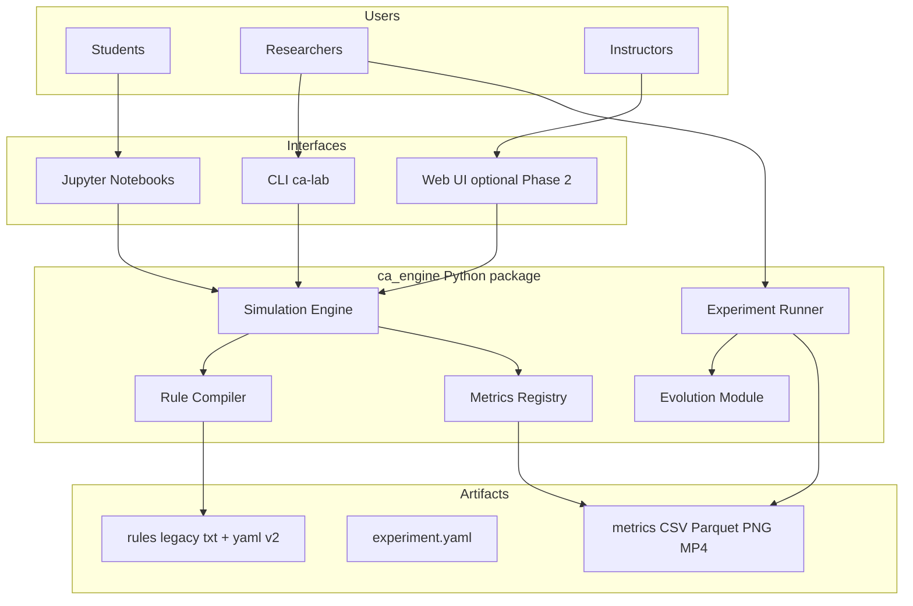
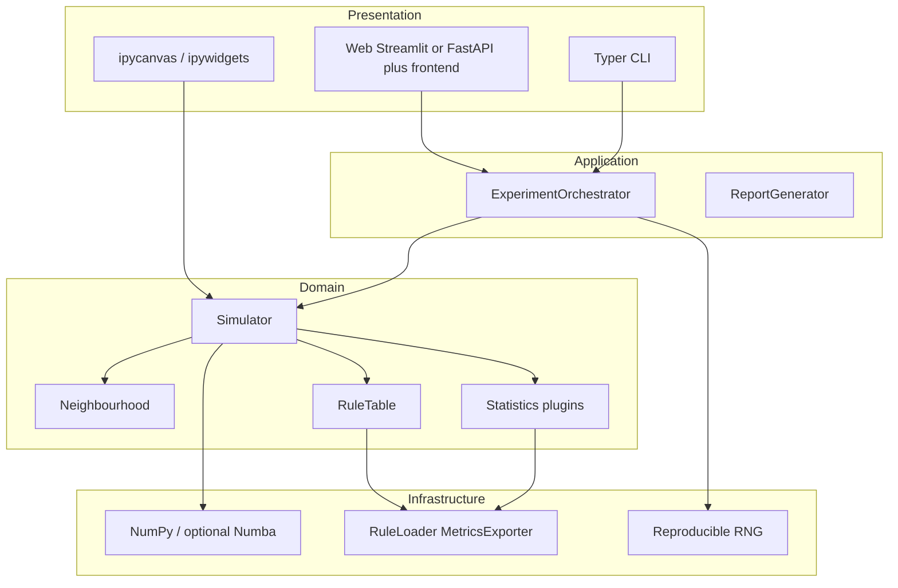
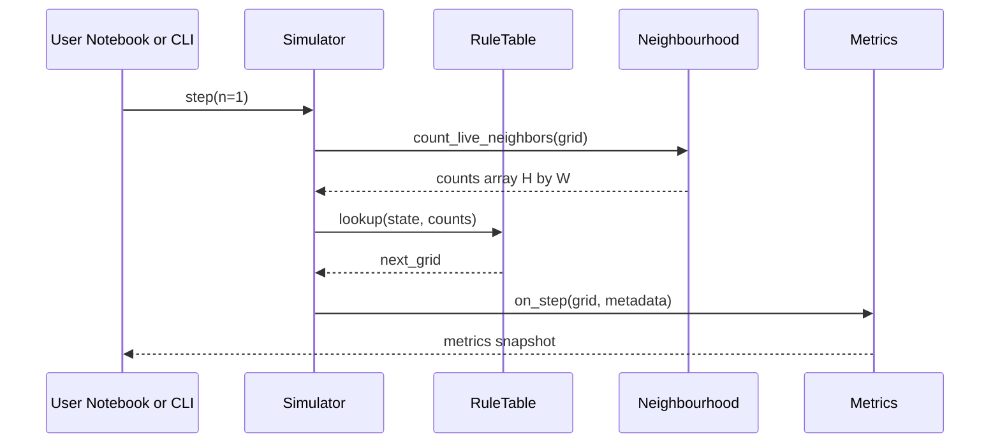
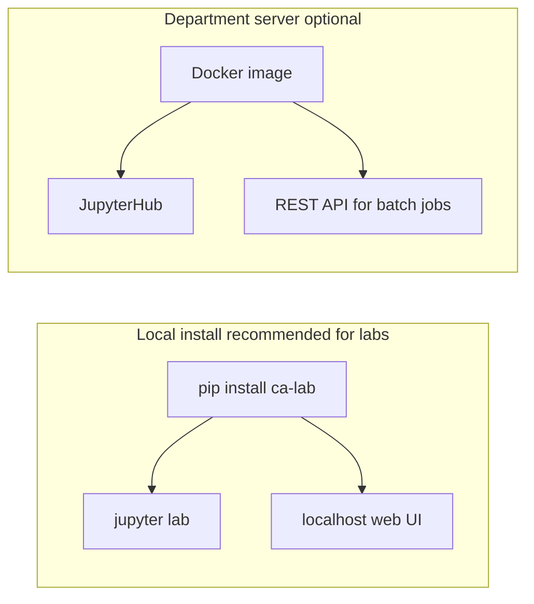

# A Reproducible Multi-State Cellular Automaton Laboratory for Education and Emergence Research

**Document type:** Technical white-paper (draft)  
**Version:** 0.1-draft  
**Date:** May 2026  
**Status:** Architecture and scope — implementation not yet started  

---

## Abstract

This document proposes **CA Lab**, a modern replacement for a legacy Java desktop cellular automaton (CA) platform developed for multi-state totalistic automata, rich emergent dynamics, and genetic search over rule tables. The new system targets **universities and researchers** who need reproducible batch experiments, extensible complexity metrics, and **student-facing Jupyter notebooks**, while remaining installable on **Windows and Linux** workstations.

The design centres on a single **Python simulation engine** (`ca_engine`) exposed through three interfaces: a **command-line tool** for scripted research, **notebooks** for teaching, and an **optional web front-end** that never duplicates core logic. Legacy rule files and palettes from the Java tool remain supported for backward compatibility and validation.

**Keywords:** cellular automata, totalistic rules, emergence, Shannon entropy, Kolmogorov complexity estimate, genetic algorithms, reproducible research, Jupyter.

---

## 1. Introduction

### 1.1 Motivation

Cellular automata are widely used to study self-organisation, artificial life, and complex systems. The original Java implementation (circa 2015, Roehampton) provides:

- Toroidal grids up to hundreds of cells per side
- Up to **101** discrete cell states with custom colour maps
- **Lookup-table rules** compiled from human-readable row files
- Real-time statistics (density, entropy, directional information gain, Kolmogorov estimates, and more)
- **Genetic evolution** of rule tables against composable fitness expressions
- Batch logging of text traces and image sequences

While functionally rich, the Java stack depends on deprecated desktop UI patterns, is difficult to integrate into modern data-science workflows, and lacks first-class **experiment reproducibility** (versioned configs, provenance hashes, portable exports). A Python migration addresses portability, teaching integration, and publication standards without discarding a decade of curated rules and research practice.

### 1.2 Contributions (planned)

1. **Vectorised simulation core** (NumPy, optional Numba) with documented formalism \(s' = T[s, n]\).
2. **Backward-compatible rule loader** for existing `rules/*.txt` files plus an optional YAML rule schema for papers.
3. **Plugin metric registry** replacing ad-hoc `*Count.java` classes.
4. **Experiment specification** (`experiment.yaml`) and CLI for headless, reproducible runs.
5. **Curriculum notebooks** for guided student exploration.
6. **Validation suite** comparing trajectories to the Java reference on canonical rules (e.g. Conway).

### 1.3 Document map

| Section | Content |
|---------|---------|
| §2 | Legacy system summary |
| §3 | Design goals and non-goals |
| §4 | Architecture and diagrams |
| §5 | Mathematical formalism |
| §6 | Metrics catalogue |
| §7 | Rules and evolution |
| §8 | Deployment: web vs CLI vs notebooks |
| §9 | Educational programme |
| §10 | Validation and benchmarks |
| §11 | Repository layout and roadmap |
| §12 | References and appendix |

Detailed reverse-engineering of the Java code lives in [REFERENCE_CODE_ANALYSIS.md](../REFERENCE_CODE_ANALYSIS.md).

---

## 2. Legacy system summary

The reference implementation is a Swing application (`CA.java`) orchestrating:

| Component | Role |
|-----------|------|
| `Life` | Simulation lifecycle, logging, seed modes |
| `Board` | Toroidal grid, neighbourhoods N4/N5/N8/N9, `applyRule` |
| `RuleFile` / `RuleRow` | Parse `[;previous;counts;next]` rows → `byte[]` table |
| `Statistic` hierarchy | Incremental metrics on cell updates |
| `Population` / `GeneticRule` | GA over rule tables |
| `CACmd` | Headless CLI for image/text batch export |

**Default rule:** Conway’s Game of Life encoded as two rows on states `{0, 1}` with live-neighbour counts (see `rules/Conway.txt`).

**Neighbour definition:** A neighbour contributes to the count if its state is **greater than zero** (not merely state `1`), enabling multi-state “activity” counts.

---

## 3. Design goals and non-goals

### 3.1 Goals

| ID | Goal |
|----|------|
| G1 | **Reproducibility** — fixed global seed, rule hash, config file archived with every run |
| G2 | **Cross-platform** — Python 3.11+ on Windows 10/11 and Linux (lab images) |
| G3 | **Performance** — vectorised stepping; optional JIT for large boards |
| G4 | **Teachability** — notebooks with minimal boilerplate |
| G5 | **Research credibility** — export Parquet/CSV, figures, provenance JSON, citable release |
| G6 | **Compatibility** — load legacy `rules/*.txt` and `ColourSetup.txt` |

### 3.2 Non-goals (Phase 1)

- 3D or asynchronous CA variants
- GPU backends (deferred)
- Real-time multiplayer collaboration
- Replacing every Swing UI feature on day one (editor → Phase 2 web or notebook widgets)

---

## 4. System architecture

### 4.1 Recommended strategy: one engine, three interfaces

Do **not** choose exclusively between web applications and Python scripts. Academic tools succeed when a **shared library** supports multiple surfaces:

| Interface | Primary users | Replaces (Java) |
|-----------|---------------|-----------------|
| **`ca_engine` package** | Developers, tests | `Board`, `Life`, `RuleRow`, statistics |
| **CLI** (`ca-lab`) | Researchers, HPC | `CACmd` |
| **Jupyter notebooks** | Students | Interactive parts of `CA` |
| **Web UI (Phase 2)** | Demos, rule painting | `CA`, `Editor`, `BoardPanel` |



### 4.2 Layered internal structure

Presentation layers contain **no science**; all dynamics live in the domain layer.



### 4.3 Simulation step (sequence)



### 4.4 Deployment options



**Recommendation for Roehampton labs:** Conda or `venv` + `pip install -e .` on student laptops (Windows) and lab Linux; optional Docker image for identical environments.

---

## 5. Mathematical formalism

### 5.1 Grid and neighbourhoods

Let the grid be \(G \in \mathbb{Z}^{H \times W}\) with toroidal boundary conditions. Cell \((x,y)\) has state \(s = G_{y,x}\).

Choose a neighbourhood template \(\mathcal{N} \subset \mathbb{Z}^2 \setminus \{(0,0)\}\) (or including centre for N5/N9). The **live neighbour count** is:

\[
n(x,y) = \big|\{ (\delta_x, \delta_y) \in \mathcal{N} : G_{y+\delta_y,\, x+\delta_x} > 0 \}\big|
\]

where indices wrap modulo \(H, W\).

Supported templates (legacy names): **N4** (von Neumann), **N5** (+ centre), **N8** (Moore), **N9** (Moore + centre).

### 5.2 Totalistic lookup update

Let \(S\) be the finite set of states \(\{0, 1, \ldots, K-1\}\). A **totalistic rule** is a table \(T : S \times \{0,\ldots,N_{\max}\} \to S\) with \(N_{\max} = 9\) in the legacy format (10 count buckets).

Single-step synchronous update:

\[
G'_{y,x} = \begin{cases}
0 & \text{if } n(x,y) \ge N_{\max}+1 \text{ or } s \ge K \\
T[s,\, n(x,y)] & \text{otherwise}
\end{cases}
\]

In implementation, \(T\) is stored as a `uint8` array of shape `(K, N_{\max}+1)` flattened as `table[s * (N_max+1) + n]`.

### 5.3 Conway’s Life as a special case

With \(K=2\), live state \(1\), dead \(0\):

- \(T[1, 2] = T[1, 3] = 1\) (survival on 2 or 3 live neighbours)
- \(T[0, 3] = 1\) (birth on exactly 3 live neighbours)
- All other entries implicitly map to \(0\) or “no change” per row semantics in the rule file compiler

---

## 6. Metrics catalogue

Metrics are **plugins** registered by name. Each may maintain incremental state on `update(old, new)` and publish values on `step()`.

| Metric | Formula / definition | Legacy class |
|--------|----------------------|--------------|
| **Density** | \(\#\{s \neq 0\} / (HW)\) | `DensityCount` |
| **Entropy** | \(H = -\sum_i p_i \log_2 p_i\), all states | `QEntropyCount` |
| **Entropy (non-zero only)** | Same, excluding state 0 | `EntropyCount` |
| **Mb4** | \((H_{\max} + H_{\text{partial}}) / H_{\max}\), \(H_{\max}=2\) | `MEntropyCount` |
| **InfoGain** (directional) | \(-\sum_{c,n} p(c,n) \log_2 p(n|c)\) for offset \((dx,dy)\) | `InfoGain` |
| **K-estimate** | LZ78 phrase count / sequence length after linearisation | `Kolmogorov` |
| **Births / deaths** | Count \(0 \to s_{>0}\), \(s_{>0} \to 0\) per step | `AntideathCount`, `DeathCount` |
| **Axis extent** | Ray length from centre along 8 directions | `AxisCount` |
| **Symmetry score** | Match under reflection / rotation transforms | `SymmetryCount` |
| **State diversity** | Number of non-zero colors with count \(> 0\) | `StateCount` |
| **Custom formula** | Safe DSL over metric names | `FormulaCount` |

**Composable fitness** (GA): expressions such as `step:+:[Density] * [Entropy]` evaluated at configured steps (legacy `Fitness` / `Evaluator`).

---

## 7. Rules and genetic evolution

### 7.1 Legacy row format (preserved)

Each line in a `.txt` rule file:

```
[;previousStates;neighbourCounts;nextState]
```

- **previousStates:** comma-separated indices and ranges (`1-4`, `0,3,5-8`)
- **neighbourCounts:** live-neighbour counts triggering this row
- **nextState:** integer next state, or empty / “no change” to retain \(s\)

Rows compile to table \(T\) by reverse iteration (later rows override earlier where overlapping).

### 7.2 Proposed YAML schema (v2, optional)

```yaml
name: Conway
neighbourhood: moore8
states: 2
transitions:
  - from: 1
    neighbors: [2, 3]
    to: 1
  - from: 0
    neighbors: [3]
    to: 1
```

Each compiled rule receives a **SHA-256 hash** stored in run provenance.

### 7.3 Genetic algorithm (Phase 1b / Phase 2)

Mirrors legacy `Population` / `GeneticRule`:

1. Initialise population of random rule tables over selected state set.
2. Run CA for configured steps; evaluate fitness expression per individual.
3. Select parents, **crossover** per-neighbour-count columns, **mutate** entries with probability \(p_m\).
4. Export best rules to `rules/generated/`.

Parallel fitness evaluation across individuals is a primary Python advantage.

---

## 8. Interface choice: web, CLI, notebooks

| Criterion | Notebooks | CLI | Web app |
|-----------|-----------|-----|---------|
| Student exploration | **Excellent** | Weak | Good |
| Reproducible research | Good (if disciplined) | **Excellent** | Medium |
| Long GA / sweeps | Poor | **Excellent** | Medium |
| Install friction | Needs Python env | Needs Python env | Low if hosted |
| Rule grid editor | Widgets | N/A | **Best** |
| White-paper acceptance | Standard | Standard | Supplementary |

**Phase 1 deliverable:** `ca_engine` + CLI + notebooks.  
**Phase 2:** Web UI calling the same Python API (FastAPI recommended for OpenAPI documentation; Streamlit acceptable for rapid departmental demo).

**Anti-pattern:** Reimplementing the simulator in JavaScript — splits validation, harms citations, duplicates professor’s rule semantics.

---

## 9. Educational programme (notebooks)

Planned notebooks under `notebooks/` (thin wrappers — logic stays in `ca_engine`):

| Notebook | Learning outcomes |
|----------|-------------------|
| `01_hello_conway.ipynb` | Grid API, `step()`, animation |
| `02_rules_and_neighbourhoods.ipynb` | Load `Conway.txt`, compare N4 vs N8 |
| `03_metrics_and_entropy.ipynb` | Time series of density and entropy |
| `04_design_your_rule.ipynb` | Author rows or YAML; predict behaviour |
| `05_batch_experiments.ipynb` | Multiple seeds, export CSV |
| `06_evolve_rules.ipynb` | Introductory GA lab (advanced) |

Widgets: step counter, speed slider, click-to-paint (ipycanvas or matplotlib).

---

## 10. Validation and benchmarks

### 10.1 Parity with Java

For each canonical rule (minimum: **Conway** on \(32 \times 32\), single-centre seed, N8):

1. Run \(T\) steps in Java reference (headless or instrumented).
2. Run \(T\) steps in `ca_engine` with identical seed and neighbourhood.
3. Assert **`np.array_equal`** on final grid (and optionally per-step hashes).

### 10.2 Performance targets (draft)

| Board size | Target step time (CPU, vectorised) |
|------------|-------------------------------------|
| \(64^2\) | \< 5 ms |
| \(256^2\) | \< 50 ms |
| \(512^2\) | \< 200 ms (Numba if needed) |

Publish benchmark hardware and commit hash in appendix.

---

## 11. Experiment specification

### 11.1 Example `experiment.yaml`

```yaml
name: conway-baseline-001
rule: rules/Conway.txt
board: [128, 128]
neighbourhood: moore8
seed:
  type: single
  state: 1
  position: center
steps: 500
global_seed: 42
metrics:
  - density
  - entropy
  - kolmogorov_horizontal
output_dir: runs/conway-baseline-001/
export:
  metrics: parquet
  frames_every: 10
  animation: mp4
```

### 11.2 CLI (planned)

```bash
ca-lab run -f experiment.yaml
ca-lab validate --rule rules/Conway.txt --steps 100 --compare-java
ca-lab evolve -f ga_experiment.yaml
```

### 11.3 Provenance artifact (`provenance.json`)

```json
{
  "ca_lab_version": "0.1.0",
  "python": "3.11.8",
  "rule_path": "rules/Conway.txt",
  "rule_sha256": "...",
  "experiment_sha256": "...",
  "global_seed": 42,
  "timestamp_utc": "2026-05-31T12:00:00Z"
}
```

---

## 12. Repository layout (planned)

```
ca_project/
  ca_engine/              # installable package
    core/                 # grid, step, neighbourhoods
    rules/                # legacy parser, YAML compiler
    metrics/              # plugin registry
    evolution/            # GA (Phase 1b)
    io/                   # export, provenance
  cli/                    # Typer entry points
  notebooks/              # student labs
  tests/                  # parity + unit tests
  docs/                   # this white-paper
  reference_code/         # frozen Java (attribution)
  rules/                  # shared rule library (or symlink)
```

---

## 13. Implementation roadmap

| Phase | Duration (indicative) | Deliverables |
|-------|----------------------|--------------|
| **0** | Complete | Java analysis doc, this white-paper draft |
| **1a** | 2–3 weeks | `ca_engine` core, Conway loader, parity tests |
| **1b** | 2 weeks | Metrics plugins, CLI, `experiment.yaml` |
| **1c** | 1–2 weeks | Notebooks 01–04, README, conda/pip install |
| **2** | 3–4 weeks | GA module, notebook 06, formula DSL |
| **3** | Optional | Web UI, rule editor, JupyterHub Docker |

---

## 14. Licensing, citation, and distribution

- **License:** Recommend **MIT** or **BSD-3-Clause** for code; CC-BY for white-paper PDF.
- **Citation:** Provide `CITATION.cff` pointing to Zenodo DOI once released.
- **Attribution:** Acknowledge original Java CA laboratory and rule corpus from Roehampton.
- **Distribution:** PyPI package `ca-lab` (name TBD); optional Docker image for labs.

---

## 15. Conclusion

Migrating the legacy Java CA platform to Python is an opportunity to modernise **how** science and teaching are done, not only **where** code runs. A single vectorised engine, legacy rule compatibility, reproducible experiment files, and Jupyter-first pedagogy form a coherent package suitable for departmental adoption and external research citation. Web interfaces remain valuable as a second-phase layer, but the authoritative semantics of the automaton must live in one well-tested Python library shared by CLI, notebooks, and UI alike.

---

## Appendix A — Class mapping (Java → Python)

| Java | Python module (planned) |
|------|-------------------------|
| `Board` | `ca_engine.core.grid.Grid` |
| `Board.applyRule` | `Grid.step(rule_table, neighbourhood)` |
| `RuleRow` | `ca_engine.rules.compiler` |
| `Statistic` | `ca_engine.metrics.registry` |
| `Life` / `LifeLog` | `ca_engine.core.simulator`, `ca_engine.io.logging` |
| `Population` | `ca_engine.evolution.population` |
| `CACmd` | `cli.run` |
| `CA` (UI) | `notebooks/*`, later `web/` |

---

## Appendix B — Bundled rules

Thirty-three legacy rule files ship under `reference_code/rules/`. Default UI selection: **Conway**. Full catalogue listed in [REFERENCE_CODE_ANALYSIS.md §5.2](../REFERENCE_CODE_ANALYSIS.md).

---

## Appendix C — Open questions

1. **Product name:** `ca-lab`, `roehampton-ca`, or neutral `totalistic-ca`?
2. **Phase 1 scope:** Include GA or ship simulator + metrics first?
3. **Hosting:** Local-only vs departmental JupyterHub?
4. **Authorship:** White-paper author list and professor attribution wording.

---

## References (to be completed)

1. Conway, J. H. (1970). *The Game of Life* — popularised totalistic birth/survival rules.  
2. Wolfram, S. (2002). *A New Kind of Science* — CA classification and experimentation.  
3. Shannon, C. E. (1948). Entropy and information theory.  
4. Lempel, A., & Ziv, J. (1978). Compression-based complexity (Kolmogorov estimate used in legacy tool).  
5. Original Java CA laboratory — Roehampton (internal; cite on release).

---

*End of draft v0.1*
