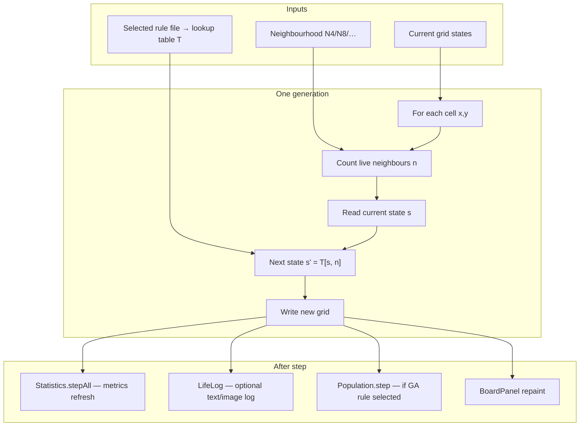

# Cellular Automaton Laboratory — High-Level Workflow Observations

**Author:** [Your name]  
**Date:** May 2026  
**Purpose:** Initial understanding of the legacy Java CA architecture, as requested before migration planning.

---

## 1. Grid and initial state (multi-color drawing)

The **grid** (`Board`) stores an integer **state** per cell — not RGB pixels. Each cell holds a value from `0` to `numcolors − 1` (up to 101 states; palette defined in `ColourSetup.txt`).

| Visual (color bar) | Stored value | Typical role |
|--------------------|--------------|--------------|
| White | `0` | Empty / background |
| Red | `1` | State 1 |
| Green | `2` | State 2 |
| Yellow, blue, … | `3`, `4`, … | Additional states |

**Drawing on the grid** sets the **initial condition** (seed pattern) before simulation runs. The user selects a brush from the color bar and paints cells manually — this replaces a hard-coded starting pattern.

- **Binary rules** (e.g. Conway): only states **0** and **1** are meaningful; other colors count as “live” for neighbours but usually die on the first step if the rule does not define them.
- **Multi-state rules** (e.g. `413.txt`): states **1–4** (and beyond) have **different transition behaviour** — multi-color drawing is required to set up meaningful experiments.

The grid uses **toroidal boundaries** (edges wrap). Neighbour counting treats any cell with **state > 0** as live for the count.

---

## 2. Metrics on each generation / step

**Statistics** (`Statistic` hierarchy) measure the current board. They update in two situations:

| Trigger | When | Examples |
|---------|------|----------|
| **User draw** | Cell changed by mouse | Incremental updates (density, per-color counts) + full recompute (`betweenStepAll`) |
| **Simulation step** | Start / Step / timer tick | Same pipeline after `Board.applyRule` |

Representative metrics include **Density**, **Entropy**, **per-state color counts**, **directional InfoGain** (Gu, Gd, …), **Kolmogorov estimates**, and **Step** count. Custom formulas can be loaded from `stats.txt`.

The left **CountBar** displays live values; enabled metrics can also be written to the log file.

---

## 3. Speed control (D:500, D:100, D:10, D:1)

**D** = **delay in milliseconds** between automatic generations when **Start** is active.

| Control | Effect |
|---------|--------|
| **D:500** | 1 step every 500 ms (default, slow — easy to observe) |
| **D:100** | 1 step every 100 ms |
| **D:10** | 1 step every 10 ms |
| **D:1** | 1 step every 1 ms (fast) |

A background **Timer** fires on this interval; if `running == true`, one `Life.update()` runs per tick. **Step** advances one generation immediately (independent of D). **Stop** pauses automatic stepping.

---

## 4. Neighbourhood (N=4, N=5, N=8, N=9)

The neighbourhood defines **which adjacent cells** contribute to the **live neighbour count** used in the rule lookup.

| Setting | Shape | Cells counted |
|---------|--------|----------------|
| **N4** | Von Neumann | Up, down, left, right (4) |
| **N5** | Von Neumann + centre | 5 |
| **N8** | Moore | 8 surrounding (default) |
| **N9** | Moore + centre | 9 |

Default: **N8**. The count is the number of neighbours with **state > 0**; that count plus the cell’s **current state** selects the next state from the rule table.

---

## 5. One generation (step) — high-level flow

When the user presses **Step** or **Start** (timer tick), one synchronous generation runs as follows:



**Rule lookup (core update):**

```
n  = number of neighbours with state > 0
s  = current cell state
s' = rule[s × 10 + n]     // 10 neighbour-count buckets (0–9)
```

**Manual draw** (outside a step) skips rule application but still updates metrics via `Board.setValue` → `Statistic.updateAll` → `Statistic.betweenStepAll`.

---

## Summary table

| Component | Role |
|-----------|------|
| **Grid + draw** | User-defined initial state; multi-state via color bar |
| **Rule** | Lookup table: (state, neighbour count) → next state |
| **Neighbourhood** | Which cells count toward `n` |
| **Step / Start** | Apply rule once or repeatedly |
| **D: delay** | Milliseconds between auto steps |
| **Metrics** | Quantify pattern on draw and after each step |
| **Log** | Optional export of stats and board images over time |

---


