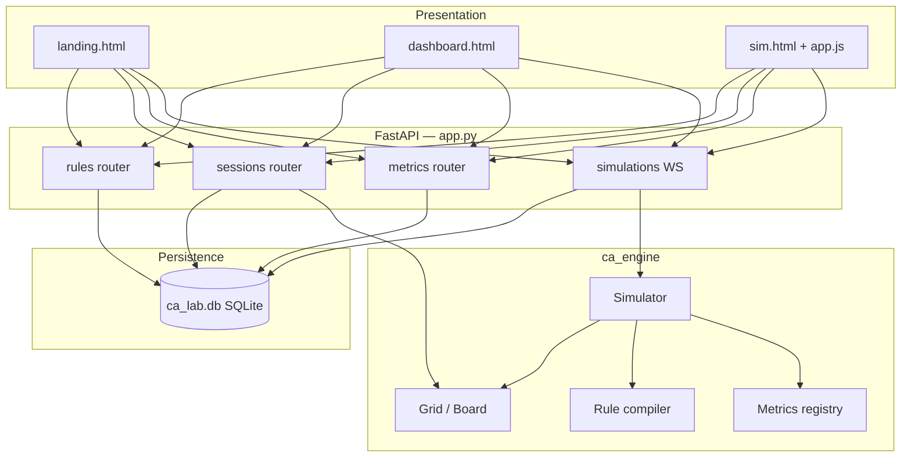

# Architecture

CA Lab follows a **layered architecture**: simulation engine at the core, HTTP/WebSocket API in the middle, static web UI on top.

## High-level diagram



## Entry points

| File | Role |
|------|------|
| `app.py` | FastAPI app, page routes, router registration |
| `start.py` | Uvicorn launcher with console banner |
| `cli/main.py` | `ca-lab` Typer CLI for headless runs |

## Web layer (`web/`)

| Module | Responsibility |
|--------|----------------|
| `database.py` | Schema, `init_db`, seed built-in rules/metrics |
| `models.py` | Pydantic request/response models |
| `routers/rules.py` | CRUD + validation for rules |
| `routers/sessions.py` | CRUD, grid, snapshots, seed → grid init |
| `routers/metrics.py` | List built-in + custom metrics |
| `routers/simulations.py` | WebSocket simulation control |
| `static/` | Landing, dashboard, simulation HTML/JS |

## Engine layer (`ca_engine/`)

| Package | Responsibility |
|---------|----------------|
| `core/grid.py` | Toroidal uint8 grid |
| `core/board.py` | Bounding box, centered coords |
| `core/simulator.py` | Step loop, double-buffered updates |
| `core/seed.py` | Initial pattern application |
| `core/neighbourhood.py` | Moore / Von Neumann counting |
| `core/palette.py` | State → RGB mapping |
| `rules/` | YAML loader, compiler, validator |
| `metrics/` | Density, entropy plugins |
| `plugins/` | Extensible plugin registry |
| `config/experiment.py` | YAML experiment schema |
| `renderers/` | Pygame and base renderer |
| `logging/` | Metrics logger, provenance |

## Data model (SQLite)

```
rules
  id, name, yaml_content, is_builtin, is_editable, description, category

sessions
  id, name, rule_id, board_width, board_height, neighbourhood,
  num_states, seed_config, current_grid (BLOB), current_step, status,
  metrics_enabled, created_at, updated_at

session_snapshots
  id, session_id, step_number, grid_state (BLOB), metrics_json

custom_metrics
  id, name, formula, description, is_builtin
```

## WebSocket protocol

**Client → Server** (JSON):

```json
{"action": "start", "grid": [[0,1,...], ...]}
{"action": "pause"}
{"action": "step", "count": 1}
{"action": "reset"}
{"action": "paint", "x": 10, "y": 20, "state": 2}
{"action": "speed", "fps": 15}
{"action": "snapshot"}
```

**Server → Client:**

1. JSON metadata: `{type: "frame", step, metrics, grid_shape, palette}`
2. Binary: raw `uint8` grid bytes (row-major)

## Key design decisions

1. **Engine/UI split** — same `Simulator` for web, CLI, and pygame.
2. **Session-centric web** — every simulation binds to a persisted session ID.
3. **Writable grids** — grids loaded via `np.frombuffer` are copied before mutation.
4. **Paint without full frame** — server skips frame broadcast on paint for latency.

## Technology stack

| Layer | Technology |
|-------|------------|
| API | FastAPI, Pydantic v2, Uvicorn |
| Database | SQLite + aiosqlite |
| Real-time | WebSockets |
| Compute | NumPy |
| Frontend | HTML5, Tailwind CSS, vanilla JS |
| CLI | Typer |
| Tests | pytest |
