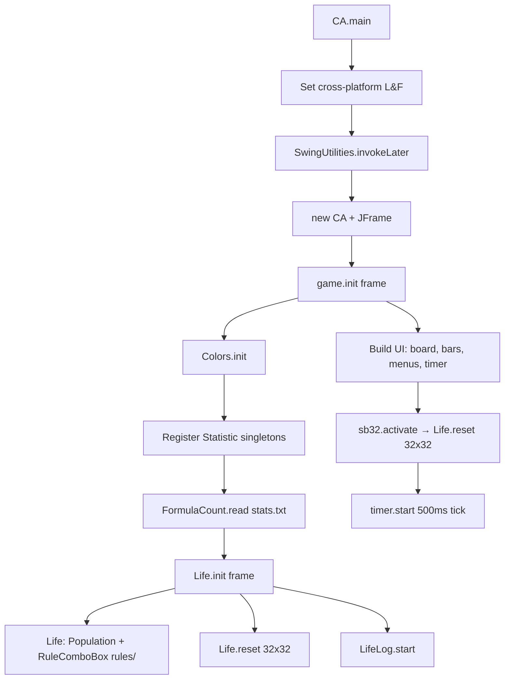
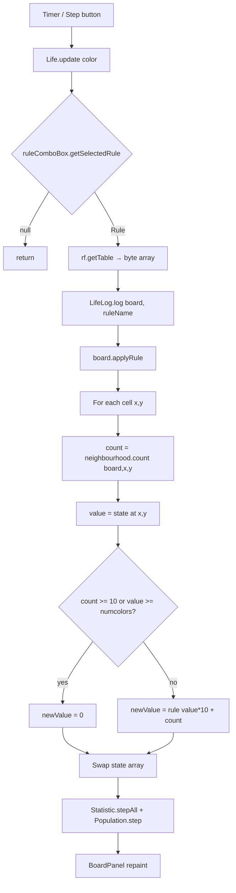
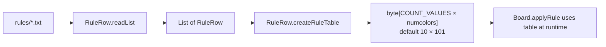
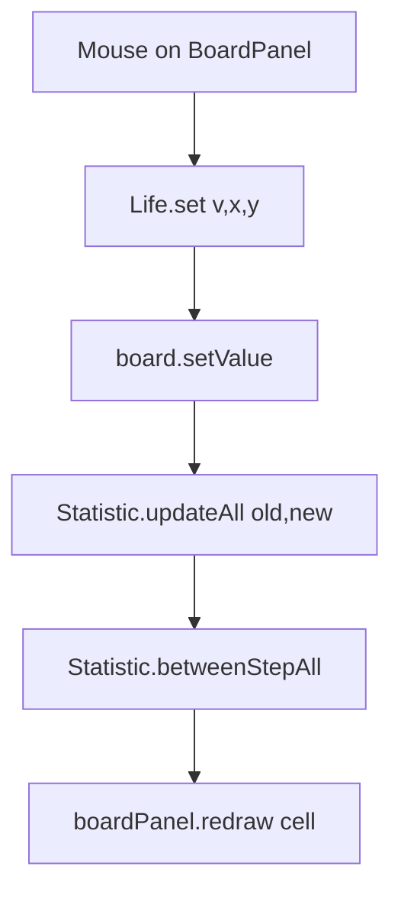
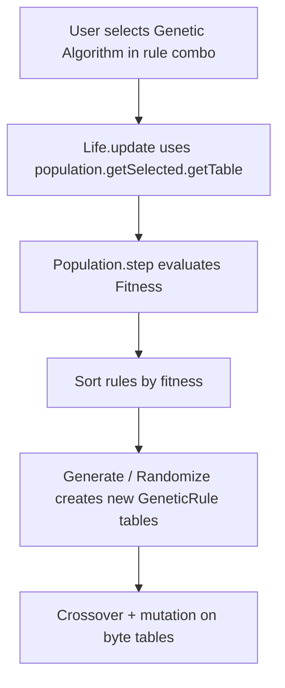
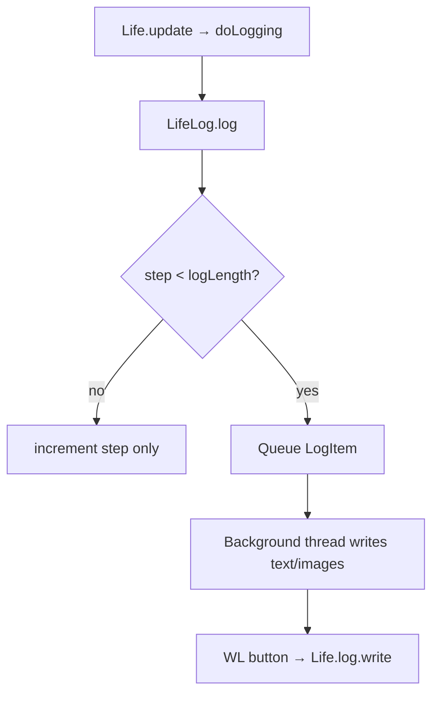
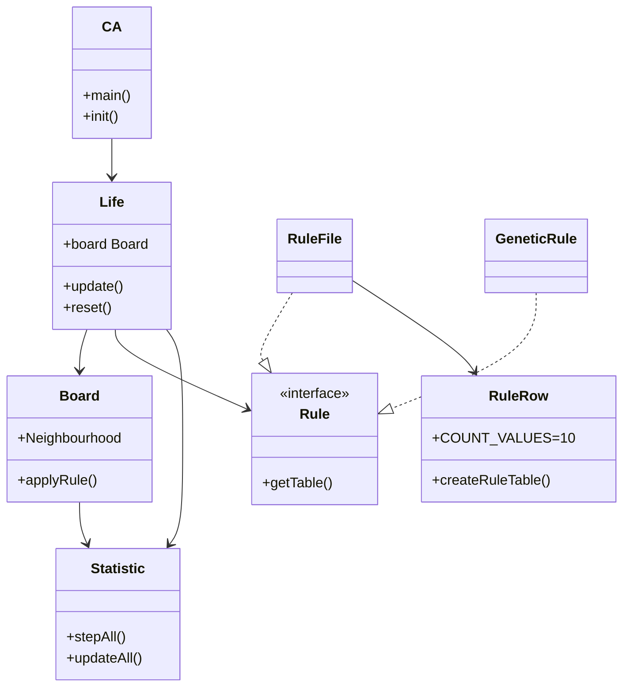

# Reference Code Analysis — Java Cellular Automaton

This document analyses the `reference_code` tree: a Swing desktop application for **multi-state totalistic cellular automata** with rule files, statistics, logging, and an optional genetic-algorithm (GA) rule evolver.

---

## Table of Contents

1. [High-Level Overview](#1-high-level-overview)
2. [Workflow Diagrams](#2-workflow-diagrams)
3. [Core Simulation Algorithm](#3-core-simulation-algorithm)
4. [Calculations and Formulas](#4-calculations-and-formulas)
5. [Rule System and Rule File List](#5-rule-system-and-rule-file-list)
6. [Statistics Registry (Active vs Disabled)](#6-statistics-registry-active-vs-disabled)
7. [Redundant and Unused Files](#7-redundant-and-unused-files)
8. [Complete File Inventory](#8-complete-file-inventory)
9. [Entry Points and How to Run](#9-entry-points-and-how-to-run)

---

## 1. High-Level Overview

| Aspect | Detail |
|--------|--------|
| **Main UI entry** | `CA.main()` → `JFrame` + `CA` panel |
| **Simulation engine** | `Life` (orchestration), `Board` (grid), `Rule` / `RuleFile` (transition tables) |
| **States** | Up to **101** discrete cell values (`Colors.numcolors`), loaded from `ColourSetup.txt` or defaults |
| **Neighbourhood** | Von Neumann **N4/N5** or Moore **N8/N9** (toroidal wrap on read/write) |
| **Rule format** | Text rows → compiled `byte[]` lookup table: `next = rule[state × 10 + neighbourCount]` |
| **Extras** | GA population (`Population`, `GeneticRule`), CLI batch runner (`CACmd`), expression-based fitness (`Fitness`, `FormulaCount`) |

The design is **not** hard-coded Conway Life only: Conway is one rule file among many. The engine is a **lookup-table CA** where each step counts live neighbours (cells with value `> 0`) and maps `(currentState, count)` → `nextState`.

---

## 2. Workflow Diagrams

### 2.1 Application startup (`CA.main`)



### 2.2 One simulation step (`Life.update`)



### 2.3 Rule compilation (file → table)



### 2.4 User edit path (mouse on grid)



### 2.5 Genetic algorithm path (embedded in main CA)



### 2.6 Logging pipeline (`LifeLog`)



---

## 3. Core Simulation Algorithm

### 3.1 Grid storage (`Board`)

- **Index**: `state[y * width + x]`
- **Toroidal boundaries**: coordinates wrapped with `(coord % size + size) % size` on `getValue` / `setValue`
- **Center**: `centerX = width/2`, `centerY = height/2` for centered seed placement
- **Live cell**: any value `> 0` (neighbour counting uses this threshold)

### 3.2 Neighbour counting (`Board.Neighbourhood`)

| Enum | Cells included | `size()` |
|------|----------------|----------|
| `N4` | up, down, left, right | 4 |
| `N5` | N4 + center | 5 |
| `N8` | Moore 8 neighbours | 8 |
| `N9` | Moore 8 + center | 9 |

Offset pairs in `neighbours[]` are `(dx, dy)` applied as `getValue(x+dx, y+dy)`; count increments when value `> 0`.

### 3.3 Rule application (`Board.applyRule`)

Pseudocode for each cell `(x, y)`:

```
count ← neighbourhood.count(this, x, y)   // live neighbours, 0..9 typically
value ← state[x, y]
if count >= countSpace OR value >= valueSpace:
    newValue ← 0
else:
    newValue ← rule[value * countSpace + count]   // countSpace = RuleRow.COUNT_VALUES = 10
```

`RuleRow.applyRuleTable(previous, count, ruleTable)` is the same indexing.

### 3.4 Seed / reset (`Life.reset`)

| `SeedType` | Behaviour |
|------------|-----------|
| `RANDOM` | Empty board, or `randomFill` if `randomFill > 0` |
| `SINGLE` | One live cell at center: `setValueCentered(1, 0, 0)` |
| `FILE` | Copy from `seedBoard` if set |

### 3.5 Image import reset (`Life.reset(pix[], w, h)`)

Maps image pixels to cell values (unused in default UI path):

```
value = (red + green + blue) * 100 / 3 / 256
```

---

## 4. Calculations and Formulas

### 4.1 Rule table size

```
tableSize = RuleRow.COUNT_VALUES × Colors.numcolors
          = 10 × numcolors   (default 10 × 101 = 1010 bytes)
```

Index: `index = previousState × 10 + neighbourCount`

### 4.2 Density (`DensityCount`)

\[
\text{Density} = \frac{\text{count of cells with state} \neq 0}{\text{width} \times \text{height}}
\]

Updated incrementally on each cell change.

### 4.3 Shannon entropy — all states (`QEntropyCount`, displayed as **Entropy**)

Let \(n_i\) be count of cells in state \(i\), \(N = \sum_i n_i\), \(p_i = n_i / N\):

\[
H = -\sum_{i:\, n_i > 0} p_i \log_2(p_i)
\]

Implementation: `acc += p * (log(p)/log(2))`, return `-acc` (or `0` if `acc == 0`).

### 4.4 Shannon entropy — non-zero states only (`EntropyCount`, **Ent-Q**)

Same formula but loop starts at `i = 1` (excludes state 0 from total and sum). **Disabled** in main `CA.init()` (commented out).

### 4.5 Mb4 metric (`MEntropyCount`)

Uses only non-zero states for \(H\) (same partial entropy as above), then:

\[
H_{\max} = 2.00 \quad \text{(hard-coded for 4-colour context)}
\]
\[
M_{b4} = \frac{H_{\max} + acc}{H_{\max}}
\]

where `acc` is the negative entropy sum before negation (code comment notes sign). **Disabled** in main CA UI.

### 4.6 Information gain (`InfoGain`) — directional mutual information

For offset \((dx, dy)\), over in-bounds pairs \((x,y)\) and neighbour \((x+dx, y+dy)\):

- \(p(c) = \text{colorCount}[c] / \text{effectivePixels}\)
- \(p(n|c) = \text{neighbourColorCount}[c][n] / \text{colorCount}[c]\)
- \(p(c,n) = p(n|c) \cdot p(c)\)

\[
\text{result} = -\sum_{c,n} p(c,n) \cdot \log_2(p(n|c))
\]

Eight instances in `CA.java`: **Gu, Gd, Gl, Gr, Gur, Gul, Gdl, Gdr** (note: **Gul** and **Gdr** both use offset `(-1, 1)` in source — likely a copy-paste bug).

### 4.7 Kolmogorov complexity estimate (`Kolmogorov.kComplexity`)

1. **Linearize** square board via `Linearizer` (horizontal, vertical, diagonal, spiral, etc.).
2. **LZ78-style compression** on integer sequence as strings; count dictionary phrases `comp`.
3. Return:

\[
K_{\text{est}} = \frac{\text{comp}}{\text{seq.length}}
\]

### 4.8 Ratio statistics (`RatioCount`)

\[
\text{ratio} = \frac{\sum_{s \in \text{numerator}} \text{count}(s)}{\sum_{s \in \text{denominator}} \text{count}(s)}
\]

**Disabled** in main CA; used in `CACmd` as `0/1`.

### 4.9 Deaths and births

| Statistic | Increment when |
|-----------|----------------|
| `DeathCount` | `oldColor != 0` and `newColor == 0` |
| `AntideathCount` | `oldColor == 0` and `newColor != 0` |

**DeathCount** commented out in CA; **AntideathCount** never registered anywhere.

### 4.10 Symmetry counts

- **`SymmetryCount`**: compares cell with transformed coordinates (H/V/D/Anti-D/180°/90°). Expensive; **never instantiated** in CA (only commented line).
- **`AxisCount`**: ray length from center along 8 axes (RHS, LHS, TVS, BVS, D1S–D4S). Registered but **`setEnabled(false)`** in CA.

### 4.11 State count (`StateCount`)

Number of distinct non-zero colors with count `> 0`. Used in `GA.java` main, not in `CA.java`.

### 4.12 Formula / fitness expressions (`Evaluator`, `FormulaCount`, `Fitness`)

**Statistic references**: `[ColumnName]` or bare names matching `Statistic.columnName(i)`.

**Operators** (from `ExpTokenizer.Op` / `Evaluator`):

| Category | Functions |
|----------|-----------|
| Step history | `stepMin`, `stepMax`, `stepMean`, `stepVar` |
| Logic | `if`, `and`, `or`, `not` |
| Math | `min`, `max`, `+`, `-`, `*`, `/`, `^`, `abs`, `log`, `log2`, `log10`, `exp`, `sqrt`, `sin`, `cos`, `tan`, `asin`, `acos`, `atan` |
| Compare | `=`, `<=`, `<`, `>=`, `>` |

**Fitness types** (`Fitness`):

| Type | Form | Update |
|------|------|--------|
| `EQ` | `step: A = B` | `\|value(A) - value(B)\|` at given step |
| `MB` | `step: hmax = n` | Running average of \((h_{\max} - H_p) / h_{\max}\) using `EntropyCount` |
| `FORM` | `step:+:expression` or `step:-:expression` | `Evaluator.evaluate(step, expression)` |

### 4.13 GA operations (`GeneticRule`)

- **Random rule**: for each state in `states`, for neighbour counts `0..neighbourhood`, assign random state from `states` (skips `(0,0)`).
- **Crossover**: for each table index, pick byte from parent selected by `crossover[j]`.
- **Mutation**: with probability `mutationChance`, resample table entry.

### 4.14 Color bar grayscale mapping (`Colors`)

For default/generated palette indices `i = 1 .. numcolors-2`:

\[
h = \frac{i-1}{\text{numcolors}-2} \times 0.9
\]

HSB color: `(h, 1.0, 1.0)` for color mode; `(0, 0, h)` for grayscale mode.

---

## 5. Rule System and Rule File List

### 5.1 Rule row syntax

Each line in a `.txt` rule file:

```
[;previousStates;neighbourCounts;nextState]
```

| Field | Meaning | Encoding |
|-------|---------|----------|
| `previousStates` | Current cell values this row applies to | Comma list and ranges: `0`, `1-4`, `0,3,5-8` |
| `neighbourCounts` | Live neighbour counts (0–9) | Same encoding; max 10 buckets (`COUNT_VALUES`) |
| `nextState` | Digit → set cell to that state; empty / non-digit → **no change** (keep previous) | `1`, `2`, or `no change` when decoded |

**Example — Conway’s Life** (`rules/Conway.txt`):

```
[;1;2,3;1]    → live (1) with 2 or 3 live neighbours stays alive (1)
[;0;3;1]      → dead (0) with exactly 3 live neighbours becomes alive (1)
```

**Example — multi-state rule** (`rules/413.txt`):

```
[;1-4;3,4;1]
[;1-4;1,2,5-8;2]
[;0-3;2;3]
[;2;2;2]
```

Rows are merged bottom-up when building the table (`createRuleTable` iterates rows in reverse).

### 5.2 Bundled rule files (33)

All paths: `reference_code/rules/`

| File | Notes |
|------|-------|
| `Conway.txt` | Classic 2-state Life (B3/S23 style on states 0/1) |
| `413.txt` | Multi-state rule (states 0–4 transitions) |
| `0AISB.txt` | AISB-related experimental rule |
| `1builder183-AISB.txt` | Builder variant |
| `1007437.txt` | Numeric / catalogued rule id |
| `-R624.txt` | Named variant R624 |
| `C6.txt` | 6-state / compact rule set |
| `D6.txt` | D6 variant |
| `DormancyA.txt` | Dormancy behaviour A |
| `DormancyB.txt` | Dormancy behaviour B |
| `DormancyC.txt` | Dormancy behaviour C |
| `R413v.txt` | R413 version 1 |
| `R413v2.txt` | R413 version 2 |
| `R4-.txt` | R4 minus variant |
| `R4N1.txt` | R4 N1 variant |
| `TGA.txt` | TGA rule |
| `TestRule.txt` | Test / development rule |
| `TextMatrix.txt` | Text/matrix pattern rule |
| `chibegam.txt` | Chi/begam experiment |
| `compexsimmetry.txt` | Complex symmetry |
| `corestructurebuilder.txt` | Core structure builder |
| `delaydeinkfractal.txt` | Delayed fractal / ink |
| `dia6.txt` | Diagonal-6 style |
| `diffrentexplosion.txt` | Explosion variant |
| `diffrnetbuilder.txt` | Different net builder |
| `dsymefractal.txt` | Dynamic symmetric fractal |
| `emergecebutdsentstay.txt` | Emergence / descent |
| `expan_becomes_dynamic.txt` | Expansion → dynamic |
| `expan_dynam.txt` | Expansion dynamic |
| `expansi_dynamic_starngetoo.txt` | Expansion dynamic strange |
| `expansion.txt` | Expansion |
| `goodamazing.txt` | Curated “good” rule |
| `strip6.txt` | Strip-6 pattern rule |

Default selected rule in UI: **`Conway`** (`Life.ruleComboBox.setSelectedName("Conway")`).

### 5.3 Runtime rule sources

| Source | Class | Used when |
|--------|-------|-----------|
| Files in `rules/` | `RuleFile` | Normal combo selection |
| GA population | `GeneticRule` via anonymous `Rule` in `RuleComboBox` | Combo item “Genetic Algorithm” |
| Editor | `Editor` + `RuleRow` | “Rule…” button mutates table before save |

---

## 6. Statistics Registry (Active vs Disabled)

### Active in `CA.init()` (main application)

| Statistic | Menu / column name | Notes |
|-----------|-------------------|-------|
| `StepCount` | Step | From `LifeLog` step on `step()` |
| `DensityCount` | Density | |
| `QEntropyCount` | Entropy | |
| `AxisCount` | Symmetry (8 axes) | **Disabled** (`setEnabled(false)`) |
| `ColorCount` | Colors | Per-state counts |
| `SizeStat` | Size | Board dimensions |
| `InfoGain` × 8 | Gu, Gd, Gl, Gr, Gur, Gul, Gdl, Gdr | Directional |
| `Kolmogorov` × 6 | K + linearizer name | Horizontal, vertical, diagonals, spiral, cont. diagonal |
| `FormulaCount` | From `stats.txt` | **All lines commented** → no custom formulas loaded |

### Commented out in `CA.init()` (code present, not registered)

| Class | Purpose |
|-------|---------|
| `DeathCount` | Deaths per step |
| `EntropyCount` | Ent-Q (non-zero states only) |
| `MEntropyCount` | Mb4 |
| `SymmetryCount` | H/V/D symmetry match counts |
| `StateCount` | Number of active states |
| `RatioCount` | Configurable ratios e.g. `0/1` |

### Never referenced in project (dead code)

| Class |
|-------|
| `AntideathCount` |

### Used only in alternate entry points

| Class | Entry point |
|-------|-------------|
| `DeathCount`, `EntropyCount`, `MEntropyCount`, `StateCount` | `GA.main` |
| `DeathCount`, `RatioCount`, … | `CACmd` |

---

## 7. Redundant and Unused Files

Classification for **reimplementing or porting** the CA core vs keeping the full research toolchain.

### 7.1 Completely unused (no references outside own file)

| File | Reason |
|------|--------|
| `AntideathCount.java` | `instance()` never called |

### 7.2 Disabled in main UI but valid code (optional / legacy)

| File | Reason |
|------|--------|
| `DeathCount.java` | Commented out in `CA.java` |
| `EntropyCount.java` | Commented out in `CA.java`; still used by `Fitness` MB mode & `GA.java` |
| `MEntropyCount.java` | Commented out in `CA.java` |
| `SymmetryCount.java` | Only commented reference in `CA.java` |
| `StateCount.java` | Commented out in `CA.java` |
| `RatioCount.java` | Commented out in `CA.java` |

### 7.3 Standalone tools / tests (not part of `CA` runtime)

| File | Purpose |
|------|---------|
| `CACmd.java` | CLI batch runner with `option` package |
| `GA.java` | Separate GA-focused window |
| `LinearizerTest.java` | Prints linearization orders; `main` only |
| `RuleRow.java` | Contains `main` for rule encode/decode tests |
| `RuleFile.java` | Contains `main` to list rule files |
| `option/Option.java`, `BasicOption.java`, `OptionParser.java`, `OptionException.java` | Only used by `CACmd` |

### 7.4 Configuration with no active effect (defaults apply)

| File | Reason |
|------|--------|
| `stats.txt` | Every formula line is commented (`#`); `FormulaCount.read()` loads nothing |

### 7.5 Duplicate / overlapping functionality

| Items | Note |
|-------|------|
| `EntropyCount` vs `QEntropyCount` | Two entropy variants; UI uses only `QEntropyCount` |
| `SymmetryCount` vs `AxisCount` | Both symmetry-related; neither fully enabled in CA |
| `GA.java` vs GA panel in `CA.java` | Two UIs for genetic search |

### 7.6 Rule files

All 33 `.txt` files under `rules/` are **loaded at runtime** if present in the `rules` folder (working directory relative). None are redundant unless you trim the catalog for a minimal port; only **`Conway.txt`** is required to match default UI behaviour.

### 7.7 Summary: minimal core for CA simulation only

**Required Java (approximate):**

`CA`, `Life`, `Board`, `BoardPanel`, `Rule`, `RuleFile`, `RuleRow`, `RuleComboBox`, `RuleTableModel`, `Editor`, `Colors`, `ColourSetup.txt`, `LifeLog`, `LogItem`, `CmdLogItem`, `LogListener`, `LogFailListener`, `LogProgressView`, `LogOptions`, `CountBar`, `CountListener`, `Statistic`, `StatisticListener`, `StatisticCheck`, `StepCount`, `DensityCount`, `QEntropyCount`, `ColorCount`, `SizeStat`, `ColorBar`, `Population`, `PopulationBar`, `PopulationListener`, `GeneticRule`, `GAOptions`, `Fitness`, `Evaluator`, `Expression`, `ExpParser`, `ExpTokenizer`, `FormulaCount`, `FileUtil`, `SnapshotDialog`, `ExitDialog`, plus UI stubs as needed.

**Safe to omit for bare simulator:** `CACmd`, `option/*`, `GA.java`, `GAHistory`, `GAResultList`, `GABestList`, `LinearizerTest`, unused statistics, `AntideathCount`.

---

## 8. Complete File Inventory

### 8.1 Java sources (72 classes)

| Package / area | Files |
|----------------|-------|
| Core | `CA`, `Life`, `Board`, `BoardPanel`, `Colors` |
| Rules | `Rule`, `RuleFile`, `RuleRow`, `RuleComboBox`, `RuleTableModel`, `Editor`, `GeneticRule` |
| Statistics | `Statistic`, `StatisticCheck`, `StatisticListener`, `StepCount`, `DensityCount`, `QEntropyCount`, `EntropyCount`, `MEntropyCount`, `DeathCount`, `AntideathCount`, `ColorCount`, `StateCount`, `SizeStat`, `AxisCount`, `SymmetryCount`, `RatioCount`, `InfoGain`, `Kolmogorov`, `FormulaCount` |
| Linearizers | `Linearizer`, `LinearizeHorizontal`, `LinearizeVertical`, `LinearizeDiagonal`, `LinearizeOtherDiagonal`, `LinearizeSpiral`, `LinearizeContDiagonal`, `LinearizerTest` |
| Expression | `Expression`, `ExpTokenizer`, `ExpParser`, `Evaluator` |
| GA | `Population`, `PopulationBar`, `PopulationListener`, `Fitness`, `GA`, `GAOptions`, `GAHistory`, `GAResultList`, `GABestList` |
| Logging | `LifeLog`, `LogItem`, `CmdLogItem`, `LogListener`, `LogFailListener`, `LogProgressView`, `LogOptions` |
| UI helpers | `ColorBar`, `CountBar`, `CountListener`, `SnapshotDialog`, `ExitDialog`, `FileUtil` |
| CLI | `CACmd`, `option/*` (4 files) |

### 8.2 Data / config

| File | Role |
|------|------|
| `ColourSetup.txt` | RGB for each state index (101 colors) |
| `stats.txt` | Custom statistic formulas (all commented in repo) |
| `rules/*.txt` | 33 rule definitions |

---

## 9. Entry Points and How to Run

| Class | Command | Role |
|-------|---------|------|
| `CA` | `java CA` (from `reference_code` with classpath `.`) | Main Swing app |
| `GA` | `java GA` | Standalone genetic algorithm UI |
| `CACmd` | `java CACmd [options] [range]` | Headless batch + image export |
| `RuleRow` | `java RuleRow` | Rule round-trip test |
| `RuleFile` | `java RuleFile` | Lists rule names |
| `LinearizerTest` | `java LinearizerTest` | Prints linearization paths |

**Working directory matters:** `rules/`, `ColourSetup.txt`, and `stats.txt` are opened with relative paths `new File("rules")`, etc.

---

## Appendix A — Class relationship (static structure)



---

## Appendix B — Timer and speeds

| `Delay` enum | ms between steps |
|--------------|------------------|
| D500 | 500 |
| D100 | 100 |
| D10 | 10 |
| D1 | 1 |

Default: **D500**. Timer always runs; `running` flag gates whether `Life.update` is called on tick.

---

*Generated from static analysis of the Java reference implementation in `reference_code/`.*
