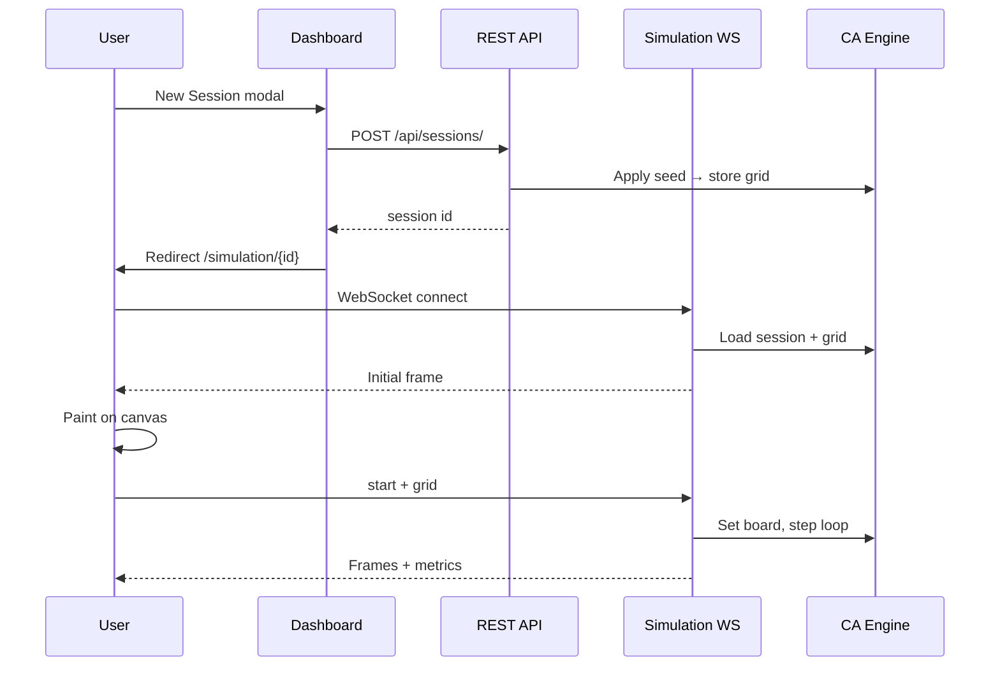

# Running Experiments

Step-by-step guide for configuring and executing CA experiments through the web UI.

## Workflow overview



## Configure an experiment

### Rule selection

Rules define how cells transition based on neighborhood counts. When you select a rule:

1. **Number of States (K)** updates from the rule's `states:` field.
2. You may increase or decrease K within 2–101 if your research requires it.
3. Ensure K matches what the rule table expects for correct behavior.

### Board size

| Size | Use case |
|------|----------|
| 32×32 – 64×64 | Teaching, quick exploration |
| 128×128 | Medium patterns |
| 256×256+ | Large-scale; slower on low-end hardware |

### Metrics

Select one or more metrics in the modal. At minimum, **density** and **entropy** give a useful structural overview. Add **entropy_nonzero** when empty cells should be excluded from entropy.

### Seed strategy

| Goal | Recommended seed |
|------|------------------|
| Classic Life demo | Center or Random 30% |
| Student assignment | Empty — students draw |
| Reproducible research | Document seed config in session name/notes |
| Custom pattern | Empty → draw → Start |

## Drawing initial state

1. Open simulation page (session must exist).
2. Wait for WebSocket **Ready** status.
3. Select a **color swatch** (left panel).
4. Click or drag on the canvas.
5. State 0 (white) erases cells.

**Tip:** Painting is local-first for responsiveness; strokes sync to the server in the background.

## Starting the simulation

Click **Start**. The client sends the full `currentGrid` to the server:

- Step counter resets to 0.
- Grid on server matches your drawing.
- Simulation loop begins at configured speed.

Always pause before editing the grid mid-session.

## Saving and exporting

| Action | Effect |
|--------|--------|
| **Save** | Persists grid + step to `sessions`; adds snapshot row |
| **Export** | Downloads `ca-lab-session-{id}.png` |
| Dashboard delete | Removes session and snapshots |

## CLI experiments

For batch runs without the browser, use experiment YAML:

```yaml
rule: Conway
width: 64
height: 64
num_states: 2
neighbourhood: moore8
steps: 500
metrics:
  - density
  - entropy
seed:
  type: random
  density: 0.3
  states: [1]
```

```bash
ca-lab run -f configs/Conway.yaml
```

See `ca_engine/config/experiment.py` for the full schema.

## Reproducibility checklist

- [ ] Record rule name and K
- [ ] Record board dimensions and neighbourhood
- [ ] Record seed type and parameters
- [ ] Save snapshot before and after key steps
- [ ] Export PNG for publications
- [ ] Note CA Lab version (`/health` or `app.py` version)
