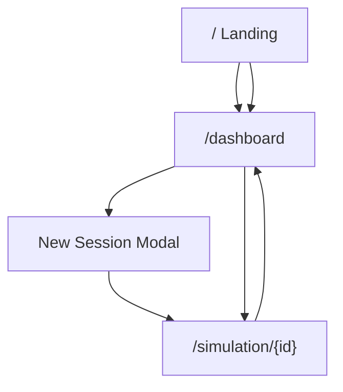

# UI Navigation

CA Lab uses three primary surfaces: **Landing**, **Dashboard**, and **Simulation**. URLs are clean (no `.html` extensions).

## Site map

| URL | Page | Purpose |
|-----|------|---------|
| `/` | Landing | Introduction, live Conway preview, CTA to dashboard |
| `/dashboard` | Dashboard | Sessions, rules, metrics; create experiments |
| `/simulation` | Simulation | Empty shell — create a session from dashboard first |
| `/simulation/{id}` | Simulation | Live CA run for session `id` |
| `/api/docs` | Swagger UI | Interactive API documentation |
| `/health` | Health check | `{"status": "healthy"}` |

---

## Landing page (`/`)

**Purpose:** First impression for researchers, educators, and students.

| Region | Content |
|--------|---------|
| Hero | Product title, tagline, primary CTA |
| Features | Multi-state CA, rules, real-time metrics |
| Live preview | Animated Conway canvas with density/entropy |
| Footer | Links to dashboard |

> **Screenshot placeholder:** `documents/assets/landing.png`  
> Capture at 1440×900 after starting the server.

---

## Dashboard (`/dashboard`)

**Layout:** Top nav · Left sidebar · Main content grid.

### Top navigation

- **CA Lab** logo → returns to landing
- **Docs** (placeholder)
- User area

### Left sidebar

| Tab | Function |
|-----|----------|
| **Sessions** | Recent sessions; click to open simulation |
| **Rules** | Searchable built-in and custom rules |
| **Metrics** | Built-in metric catalog |

**New Session** button opens the experiment configuration modal.

### Main area

- **Quick stats** — session count, rules, metrics
- **Recent Sessions** grid — View / Delete per session

> **Screenshot placeholder:** `documents/assets/dashboard.png`

### New Session modal

| Field | Description |
|-------|-------------|
| Session Name | Display name for the experiment |
| Select Rule | Searchable rule list |
| Width / Height | Grid dimensions (8–512) |
| Number of States (K) | From rule YAML; user-editable |
| Initial Seed | Random, center, or empty |
| Metrics to Track | Searchable multi-select checkboxes |

> **Screenshot placeholder:** `documents/assets/new-session-modal.png`

---

## Simulation (`/simulation/{id}`)

**Layout:** Controls (left) · Canvas (center) · Metrics (right).

### Left panel — Controls

| Section | Controls |
|---------|----------|
| Playback | Start, Pause, Step, Reset |
| Speed | Slider 10–500 ms per step |
| Brush | Color swatch grid for states 0…K−1 |
| View | Grid lines, cell numbers toggles |

### Center — Canvas

- Full-panel responsive grid
- Real-time painting when paused
- Pixel-crisp rendering with optional grid overlay

### Right panel — Metrics

Live cards for density, entropy, activity, stability, plus session info (board size, K, rule name).

### Top bar

Save · Export PNG · Back to Dashboard · Status badge · Step counter

> **Screenshot placeholder:** `documents/assets/simulation.png`

---

## Keyboard and accessibility

- Tab through interactive controls
- Modal traps focus while open
- `prefers-reduced-motion` respected in CSS
- High-contrast typography (Crimson Pro + Atkinson Hyperlegible)

---

## Adding screenshots

See [assets/README.md](../assets/README.md) for naming conventions and capture checklist.
