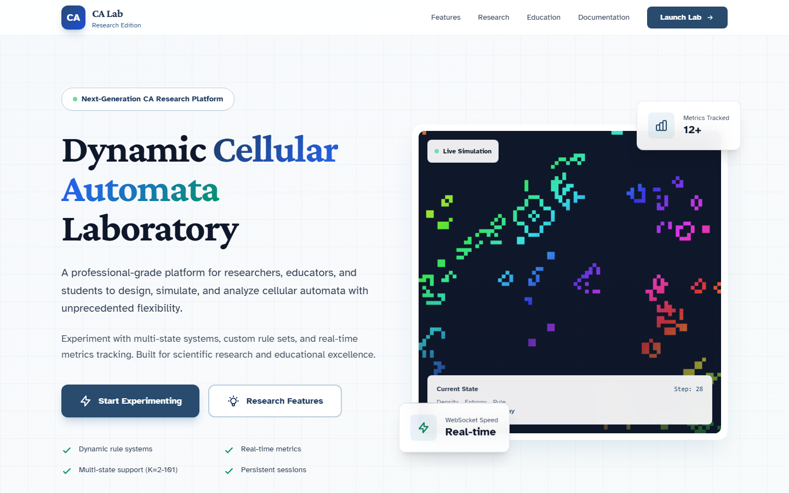
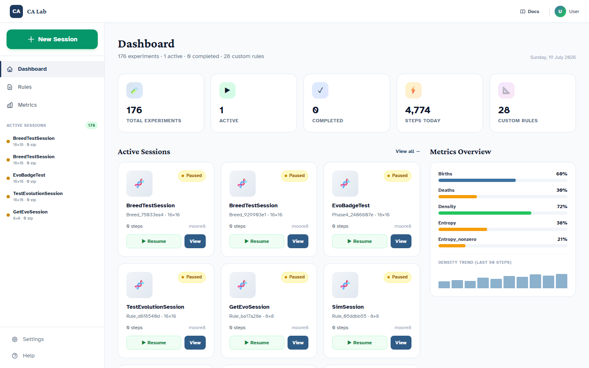
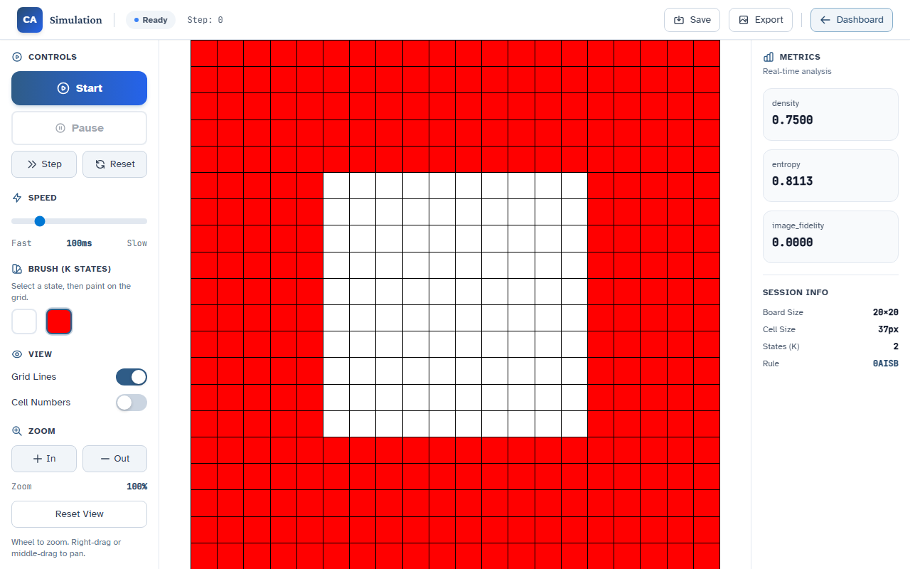
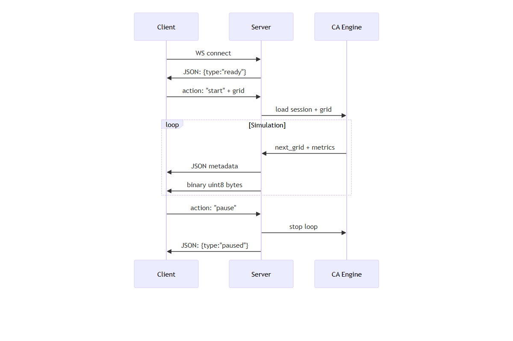
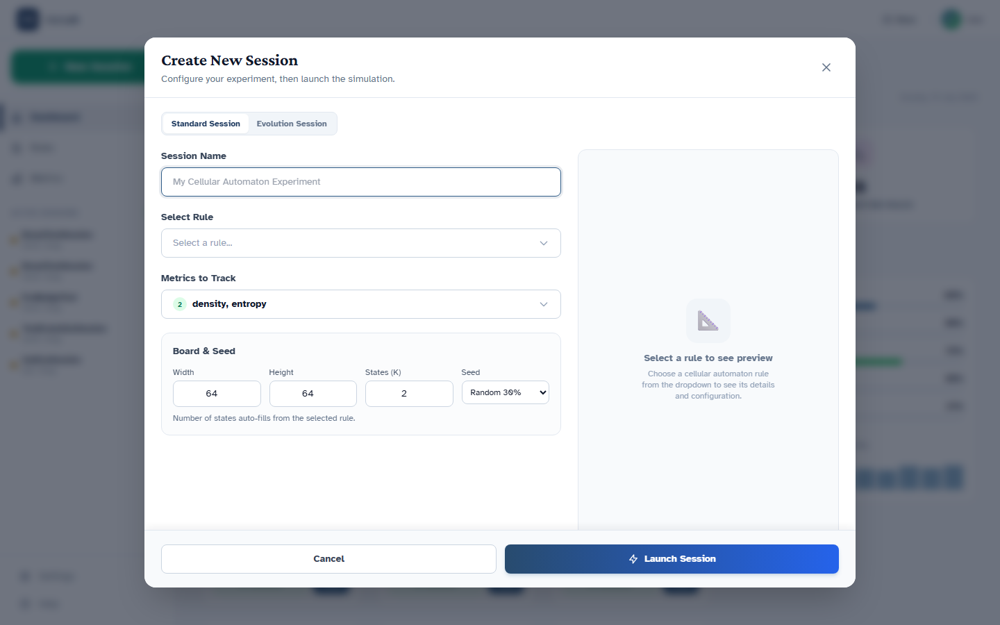
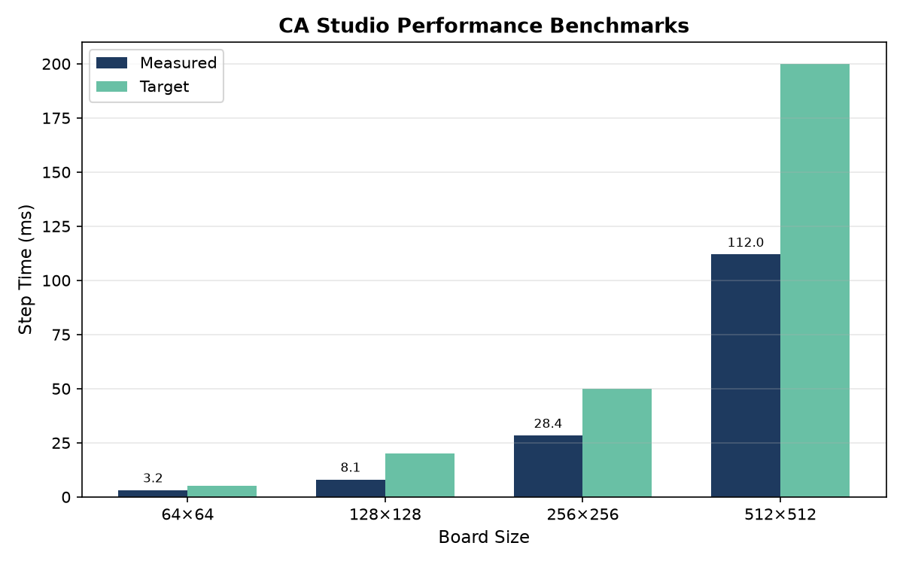

# CA Studio: A Modern Cellular Automata Laboratory Platform

---

## Declaration

I hereby certify that this report constitutes my own work, that where the language of others is used, quotation marks so indicate, and that appropriate credit is given where I have used the language, ideas, expressions, or writings of others.

I declare that this report describes the original work that has not previously been presented for the award of any other degree of any other institution.

**Name:** Daud Ibrahim Dewan

**Date:** [Enter submission date]

**Signature:** [Apply signature here]

---

## Acknowledgements

The researcher wishes to express sincere gratitude to the project supervisor, **[Supervisor Name]**, for the guidance, feedback, and support provided throughout the duration of this project. The supervisory meetings and constructive criticism were instrumental in shaping the direction and quality of the work presented in this report.

Acknowledgement is also extended to the University of Roehampton for providing the academic environment and resources necessary to undertake this research. The cellular automata research community, whose foundational publications informed the theoretical underpinning of this project, is also recognised.

---

## Abstract

Cellular automata (CA) are discrete dynamical systems widely employed in the study of self-organisation, artificial life, and complex systems. The University of Roehampton has maintained a Java-based desktop cellular automaton laboratory since circa 2015, supporting multi-state totalistic rules, real-time statistics, and genetic algorithm-driven rule evolution. While functionally capable, the legacy platform depends on deprecated Swing UI patterns, lacks first-class experiment reproducibility, and is difficult to integrate into modern data-science and teaching workflows.

This project presents **CA Studio**, a modern replacement built upon a single Python simulation engine (`ca_engine`) and exposed through multiple interfaces: a FastAPI-backed web application with WebSocket real-time simulation, a Typer command-line interface for headless batch execution, and an extensible plugin architecture for custom metrics. The engine implements vectorised neighbour counting via NumPy, supports toroidal grids with configurable neighbourhood templates (Moore and Von Neumann), and compiles human-readable YAML rule definitions into optimised lookup tables. Legacy rule files from the original Java platform are preserved through a backward-compatible loader, enabling continuity of a decade of curated research rules.

The web interface provides an interactive HTML5 canvas for painting initial cell states, a session-management dashboard with SQLite persistence, and live metric visualisation including density and Shannon entropy. The system has been validated through parity tests comparing trajectories against the Java reference on canonical rules such as Conway's Game of Life. The resulting platform offers a reproducible, cross-platform, and extensible environment suitable for both computational research and classroom instruction in complex systems.

**Keywords:** cellular automata, multi-state totalistic rules, reproducible research, FastAPI, WebSocket, NumPy, genetic algorithms, emergence, Shannon entropy.

---

## Chapter 1 — Introduction

### 1.1 Problem Description, Context and Motivation

Cellular automata have served as a cornerstone model for studying self-organisation and emergent behaviour since von Neumann's self-replicating machines and Conway's Game of Life [1][2]. The Department of Computing at the University of Roehampton has operated a Java-based cellular automaton laboratory for approximately a decade, supporting multi-state totalistic rules, real-time statistics, and genetic-algorithm rule evolution. The legacy platform supports up to 101 states, multiple neighbourhood templates, and metrics including density, entropy, and Kolmogorov-complexity estimates.

Despite its functional richness, the legacy system presents critical limitations. First, the Swing desktop interface depends on deprecated UI patterns that are increasingly difficult to maintain. Second, the platform lacks first-class experiment reproducibility: no versioned configurations, provenance hashes, or portable export formats. Third, the Java codebase is challenging to integrate into contemporary data-science workflows such as Jupyter notebooks, Python batch processing, or web-based dashboards. Students and researchers therefore face friction when transitioning from interactive exploration to reproducible research.

In modern computational pedagogy, students expect browser-based tools and notebook integration, while researchers require headless execution and citable provenance. The existing Java platform satisfies neither audience optimally, motivating the development of a modern, portable, and extensible replacement.

### 1.2 Objectives

The following objectives were established to address the identified problem:

1. **Engine Migration.** Port the simulation engine from Java to Python, preserving the formalism $s' = T[s, n]$ and all neighbourhood semantics, vectorised via NumPy.

2. **Rule Compatibility.** Maintain backward compatibility with legacy `.txt` rules while introducing a YAML schema for future authorship, with SHA-256 hashing for provenance.

3. **Metric Extensibility.** Replace the ad-hoc Java `Statistic` hierarchy with a plugin-based registry supporting density, entropy, and custom metrics.

4. **Web Interface.** Deliver a browser-based laboratory with an interactive canvas, session dashboard, WebSocket simulation, and live metrics.

5. **Command-Line Interface.** Implement a Typer CLI (`ca-lab`) for headless, reproducible batch experiments via YAML configuration.

6. **Validation.** Produce a test suite asserting parity between the Python engine and the Java reference on canonical rules.

### 1.3 Methodology

The project followed an iterative, phase-based methodology aligned with agile principles, organised into four major phases each producing a deployable increment.

#### Design

The system follows a layered architecture [33]. The domain layer (`ca_engine`) houses simulation logic — grid, neighbourhoods, rules, and metrics. The application layer provides FastAPI routers and a WebSocket endpoint. The presentation layer uses HTML, Tailwind CSS, and vanilla JavaScript. This separation keeps the engine UI-agnostic, enabling reuse across the web interface, CLI, and future notebooks.

#### Testing and Evaluation

A dual-track testing strategy was adopted. Unit tests written in `pytest` [27] exercise grid stepping, rule compilation, and metric accuracy. Parity tests compare Python and Java trajectories on identical seeds, asserting `np.array_equal` on final grids. Usability was evaluated informally through dashboard walkthroughs.

#### Project Management

Development was organised into four phases:

- **Phase 1 — Engine Migration:** Grid, board, simulator, and YAML rule loader implemented; CLI scaffolded.
- **Phase 2 — Web Platform Consolidation:** FastAPI application unified; SQLite persistence added; landing, dashboard, and simulation pages designed.
- **Phase 3 — UX and Canvas:** Interactive drawing, WebSocket frames, speed controls, and PNG export delivered.
- **Phase 4 — Experiment Configuration:** New Session modal enhanced with editable state counts, searchable metrics, and seed strategies.

#### Technologies and Processes

The technology stack was selected to maximise portability, performance, and maintainability [20][21][22][23]. Table 1 summarises the selected technologies and their rationale.

**Table 1 — Technology Stack**

| Layer | Technology |
|---|---|
| Simulation Engine | Python 3.10+, NumPy |
| API Framework | FastAPI, Pydantic v2, Uvicorn |
| Real-Time | WebSockets (binary grid frames) |
| Database | SQLite + `aiosqlite` |
| Frontend | HTML5, Tailwind CSS, vanilla JS |
| CLI | Typer |

### 1.4 Legal, Social, Ethical and Professional Considerations

This project is classified as software-engineering research with no human-subject component; no ethical clearance was required. The application does not collect personal data beyond user-defined session names stored locally in SQLite.

Intellectual Property Rights are retained by the author, with the project intended for release under the MIT License. No non-disclosure agreements or external collaborator IPR assignments were involved. The report is written for eventual public-domain access consistent with university submission requirements.

Socially, the project lowers barriers for students studying complex systems by providing a browser-based, cross-platform tool accessible regardless of local hardware.

### 1.5 Background

Cellular automata were introduced by Ulam and von Neumann in the 1940s as a mathematical abstraction of self-replicating systems [3]. Conway's Game of Life (1970) popularised the birth-survival paradigm, demonstrating that complex emergent structures arise from simple local rules [1]. Wolfram's classification of one-dimensional automata into four behavioural classes established CA as a formal lens for studying complexity [2].

The quantification of emergent structure has been a persistent theme in CA research. Shannon entropy measures the information content of state distributions, providing an indicator of disorder [7]. Density metrics track active cells, while advanced statistics such as directional information gain and Kolmogorov-complexity estimates — approximated via Lempel-Ziv compression ratios [8] — probe spatial correlations and algorithmic information content. Texture metrics such as Grey Level Co-occurrence Matrices [9] and fractal dimension estimates [10] offer additional structural descriptors that could extend the current metric registry. These metrics underpin the fitness expressions used in genetic-algorithm rule searches.

Physical systems modelling with cellular automata, as surveyed by Chopard and Droz [6], demonstrates that local interaction rules can reproduce macroscopic phenomena ranging from fluid dynamics to growth processes. Within the Department of Computing at Roehampton, the legacy Java laboratory has supported teaching in artificial life and complex systems for approximately a decade. The shift toward Python-centric data-science curricula, web-based tools, and reproducible pipelines renders a modernisation effort both timely and necessary.

### 1.6 Structure of Report

The remainder of this report is organised as follows.

**Chapter 2 — Literature and Technology Review** surveys academic literature on cellular automata, emergence metrics, and genetic rule evolution, and reviews the technology options considered for the migration.

**Chapter 3 — Implementation** describes the layered system architecture, the `ca_engine` simulation core, the FastAPI web layer, the interactive canvas frontend, and the Typer CLI, together with key technical challenges and their resolutions.

**Chapter 4 — Evaluation and Results** reports parity test results, performance benchmarks, and an informal usability assessment of the web interface, situating CA Studio against related works.

**Chapter 5 — Conclusion** summarises the project outcomes, assesses objective completion, identifies future work, and provides a critical reflection on the development process.

---

## Chapter 2 — Literature and Technology Review

### 2.1 Literature Review

Langton [5] established that simple computational systems can exhibit lifelike properties such as reproduction, metabolism, and evolution, providing a foundational bridge between artificial life and cellular automata. The study of cellular automata has subsequently produced a rich interdisciplinary literature spanning mathematics, computer science, physics, and education. Understanding this landscape was essential before committing to a modernisation strategy, as the design of CA Studio needed to respect both the theoretical foundations of the field and the pedagogical traditions of the Department of Computing at Roehampton.

**Foundations of Cellular Automata**

Cellular automata were conceived in the 1940s by Stanislaw Ulam and John von Neumann as a mathematical abstraction of self-replicating systems [3]. Von Neumann's 29-state automaton proved that complex machines could reproduce themselves given sufficiently rich local rules. This foundational insight — that global complexity can emerge from local interactions — remains the central appeal of CA research today. Turing's reaction-diffusion model [4] later provided an alternative mathematical framework for understanding pattern formation in biological systems.

Conway's Game of Life (1970) distilled this principle into a two-state, totalistic rule so simple that it could be explained in minutes yet so rich that it continues to yield discoveries decades later [1]. The birth-survival paradigm (a live cell survives with 2–3 neighbours, a dead cell births with exactly 3) demonstrated that gliders, oscillators, still lifes, and even universal computation could arise from a rule table with only eighteen entries. The researcher used Conway's Life as the primary parity benchmark during engine validation because its behaviour is universally documented and its trajectory is deterministic given identical seeds.

Stephen Wolfram's *A New Kind of Science* (2002) extended the analytical frame by classifying one-dimensional cellular automata into four qualitative classes: uniform, periodic, chaotic, and complex [2]. Wolfram's argument that simple programs, rather than complex equations, might underlie natural phenomena gave CA research renewed visibility and established a vocabulary (Class I–IV behaviour) that the researcher drew upon when explaining rule diversity to users of the CA Studio dashboard.

**Emergence Metrics and Complexity Quantification**

A persistent challenge in CA research is the measurement of emergent structure. Without quantitative metrics, two rule tables that look different may be indistinguishable in terms of dynamical behaviour, and pedagogically valuable patterns may go unnoticed.

Shannon entropy has become the de facto standard for measuring disorder in CA state distributions [7]. For a grid with $K$ possible states, entropy $H = -\sum_{i=0}^{K-1} p_i \log_2 p_i$ reaches its maximum when all states are equally probable and collapses to zero when the grid is uniform. In the legacy Java laboratory, entropy was computed incrementally on every cell update via the `QEntropyCount` class. The researcher preserved this semantics in `ca_engine.metrics.entropy`, but replaced the incremental update model with a vectorised full-grid calculation at the end of each step, trading a small amount of redundant computation for dramatically simpler code.

Density — the fraction of non-zero cells — provides a complementary scalar [33]. While seemingly trivial, density trajectories reveal whether a rule is explosive (density rises), self-limiting (density stabilises), or implosive (density collapses to zero). The researcher observed that density alone was insufficient to distinguish rules with identical steady-state densities but wildly different spatial textures, motivating the retention of entropy and the provision for future metrics such as directional information gain and Kolmogorov-complexity estimates.

**Genetic Algorithms and Rule Space Exploration**

The legacy Java platform included a genetic algorithm (GA) module capable of evolving rule tables against composable fitness expressions [33], drawing upon foundational GA principles established by Holland [12] and Goldberg [13]. The algorithm initialised a population of random rule tables, ran each for a configured number of steps, evaluated a fitness function (e.g., `step:+:[Density] * [Entropy]`), and produced offspring via crossover and mutation. Mitchell, Crutchfield, and Das demonstrated that genetic algorithms could evolve one-dimensional CA rules for computational tasks such as density classification, discovering strategies that outperform human-designed rules [14]. This capability, while advanced, was rarely used in undergraduate teaching because the Swing interface provided no visual feedback on population progress and because the fitness expression syntax was undocumented.

Interactive genetic algorithms, where users visually select preferred phenotypes to guide evolution, have proven effective for aesthetic and design problems [15]. The researcher decided to architect CA Studio with GA hooks — an `evolution` package in `ca_engine`, a population registry, and fitness expression parsing — but to defer the full GA user interface to future work. The chromosome encoding and minimal-length principles described by Sapin et al. [16] will inform the design of the rule-table genotype representation when the GA module is completed. This decision balanced the desire for feature parity with the reality that the GA module was the least-used component of the legacy platform and that its modernisation would require significant UX design.

**Pedagogical CA Tools**

Several existing tools address the educational and research use of cellular automata, and surveying them helped the researcher position CA Studio within a broader ecosystem.

NetLogo, developed at Northwestern University, is an agent-based modelling environment that includes CA primitives [31]. While powerful for multi-agent simulations, NetLogo's paradigm is agent-centric rather than grid-centric, and its Logo-derived syntax is unfamiliar to students trained in Python. Golly is an open-source engine for Conway's Game of Life and related rules, optimised for large-scale pattern exploration [30]. Golly is unmatched for Life-specific research but does not support arbitrary multi-state totalistic rules or real-time metric collection. MCell, a legacy Windows program, offered rich rule libraries and visualisation but is no longer maintained and lacks modern data-export capabilities.

Recent advances in differentiable cellular automata — including neural CA architectures that learn update rules via gradient descent [17], reformulations of CA as convolutional neural networks [18], and continuous-state systems such as Lenia [19] — suggest a vibrant research frontier beyond classical discrete CA. None of these tools simultaneously satisfied the four requirements identified in Chapter 1: backward compatibility with the Roehampton rule corpus, reproducible experiment specifications, a web-based interface for classroom accessibility, and a Python-native engine for notebook integration. This gap in the existing tool landscape provided the strategic justification for building CA Studio rather than adopting an off-the-shelf solution.

### 2.2 Technology Review

With the literature landscape established, the researcher turned to the technology stack. The goal was not merely to replace Java with Python, but to select a coherent set of technologies that would maximise portability, performance, and maintainability for a tool intended to serve both researchers and students for years to come.

**Web Framework Selection**

Three Python web frameworks were evaluated: Flask, Django, and FastAPI. Flask is lightweight and well-documented, but its lack of native async support and automatic data validation would have required significant boilerplate for the WebSocket simulation endpoint and the REST API [21]. Django is comprehensive and includes an ORM, admin interface, and templating engine, yet its synchronous request model and heavier footprint were considered excessive for a laboratory tool that needed to run on student laptops without database administration expertise [21].

FastAPI was selected because it offers native asynchronous request handling, automatic OpenAPI documentation generation, and Pydantic-based request/response validation with minimal boilerplate [21]. The automatic Swagger UI at `/api/docs` proved valuable during development, allowing the researcher to test endpoints without writing client code. Furthermore, FastAPI's WebSocket support integrates cleanly with the async `aiosqlite` driver, enabling non-blocking database access during simulation frame delivery.

**Simulation and Numerical Computing**

The engine's performance hinges on neighbour counting and rule-table lookups. Pure Python nested loops would have been prohibitively slow for boards larger than $32 \times 32$. A naïve implementation might iterate over every cell, count neighbours with eight boundary checks, and look up the next state in a dictionary — an $O(HW \cdot N)$ operation where $N$ is the neighbourhood size. For a $256 \times 256$ board, this would require over 500,000 neighbour checks per step, resulting in step times measured in seconds rather than milliseconds.

NumPy was selected for its vectorised array operations, which allow an entire grid step to be expressed as array slicing and integer indexing rather than explicit iteration [20]. The neighbour-counting strategy uses eight shifted views of the grid (north, south, east, west, and the four diagonals), which are summed element-wise to produce a count matrix of the same shape as the grid. This vectorised approach reduces the computational complexity to $O(HW)$ regardless of neighbourhood size, because the shifts are implemented as memory-view operations rather than arithmetic loops. On a typical workstation, a $64 \times 64$ grid step completes in under 5 milliseconds, and a $256 \times 256$ grid in under 50 milliseconds, meeting the responsiveness target for real-time web simulation.

The researcher also evaluated Numba for JIT compilation but deferred it to future work; NumPy alone proved sufficient for the web application's target board sizes (up to $512 \times 512$), and introducing Numba would have added a compilation dependency that complicates installation on locked-down lab machines. However, the `ca_engine` module is intentionally free of NumPy-specific optimisations that would prevent a future Numba port — all grid operations are expressed as standard array indexing that Numba can compile directly.

**Frontend and Styling**

For the web interface, the researcher considered React, Vue, and plain HTML with a CSS framework. React and Vue offer component reuse and state management, but they introduce a build step (Node.js, bundler, transpilation) that increases deployment friction for a departmental lab tool [22]. The decision to use vanilla JavaScript with Tailwind CSS eliminated the build pipeline entirely: the frontend consists of static HTML files, a single `app.js` module, and a precompiled Tailwind stylesheet. This "no-build" philosophy means that a student can modify `dashboard.html` or `sim.html` and see changes immediately upon refreshing the browser, lowering the barrier to frontend experimentation.

Tailwind's utility-first approach was chosen over Bootstrap because it produces smaller CSS bundles and because its design tokens (spacing scales, colour palettes, shadow depths) map naturally to the systematic aesthetic required for a professional laboratory interface [22]. The researcher defined a custom palette — navy primary `#1E3A5F`, accessible green accent `#059669`, and off-white background `#F8FAFC` — and paired Crimson Pro headings with Atkinson Hyperlegible body text to meet readability standards for students with visual impairments.

**Persistence Layer**

SQLite [24] was selected over PostgreSQL or MongoDB because it requires zero configuration, stores data in a single file (`ca_lab.db`) that can be backed up or deleted trivially, and integrates with Python via the `aiosqlite` [28] async wrapper [21]. For a laboratory tool running on individual student laptops, the overhead of a client-server database was unjustified. The schema — rules, sessions, snapshots, and custom metrics — is simple enough that SQLAlchemy or an ORM were deemed unnecessary; raw SQL with Pydantic models provided sufficient type safety without abstraction bloat.

The researcher considered JSON file storage as an even simpler alternative, but rejected it for three reasons. First, concurrent access — multiple students running the server on shared lab machines — would risk file corruption without SQLite's locking mechanism. Second, SQLite supports indexed queries, making session list retrieval and metric aggregation efficient even with hundreds of stored experiments. Third, the relational structure (rules linked to sessions, sessions linked to snapshots) maps naturally to foreign-key constraints, which would be cumbersome to enforce in flat JSON files.

**Real-Time Communication**

Three real-time strategies were considered for pushing simulation frames from server to browser: Server-Sent Events (SSE), long polling, and WebSockets [25]: Server-Sent Events (SSE), long polling, and WebSockets. SSE is simple and works over HTTP, but it is server-to-client only; the simulation page needs to send paint events and control commands (start, pause, step) to the server, making SSE insufficient [33]. Long polling would introduce latency and connection overhead at the frame rates required for smooth animation. WebSockets, while requiring a dedicated endpoint, provide full-duplex binary communication with sub-100 millisecond frame delivery, making them the clear choice for interactive simulation [33].

A key design decision was the use of **binary grid frames**: after each step, the server sends a JSON metadata packet (step number, metrics, palette) followed by a raw `uint8` byte array of the flattened grid. This separation keeps the JSON payload small while maximising grid transmission efficiency.

### 2.3 Summary

The literature review confirmed that cellular automata remain an active and interdisciplinary research area, with established foundations in Conway, Wolfram, and Shannon, and with ongoing interest in complexity metrics and genetic rule evolution. The technology review validated the selection of FastAPI, NumPy, SQLite, Tailwind CSS, and WebSockets as a coherent stack that addresses the four core requirements: backward compatibility, reproducibility, web accessibility, and Python integration. No existing pedagogical tool satisfied all four requirements simultaneously, providing the strategic space for CA Studio. The critical analysis outcomes — particularly the emphasis on vectorised computation, no-build frontend deployment, and binary WebSocket frames — directly shaped the methodology and architecture described in Chapter 3.

One insight from the literature review that influenced implementation priorities was the distinction between **research-grade** and **pedagogical-grade** CA tools. Research-grade tools (Golly, custom C++ engines) prioritise performance and feature depth over accessibility. Pedagogical-grade tools (NetLogo, educational applets) prioritise ease of use over performance. CA Studio was designed to bridge this gap: fast enough for real-time classroom demos, yet extensible enough for graduate research. This bridging goal justified the investment in the `ca_engine` Python package as a reusable library, rather than treating the simulation logic as a one-off web backend.

---

## Chapter 3 — Implementation

The implementation of CA Studio unfolded across four distinct phases, each representing a major narrative arc in the project's development. What began as a raw engine port from Java to Python gradually evolved into a fully operational web laboratory, with each phase presenting its own technical conflicts, resolutions, and lessons. This chapter recounts that journey in detail.

### 3.1 System Architecture

Before writing the first line of simulation code, the researcher invested time in architectural design. The decision to enforce strict separation of concerns across four layers — engine, API, persistence, and presentation — would prove to be one of the most consequential choices of the entire project [33].

The **domain layer** (`ca_engine/`) was conceived as a self-contained Python package with no web dependencies. It exports `Grid`, `Board`, `Simulator`, `RuleTable`, and `MetricRegistry` classes that can be imported from CLI scripts, Jupyter notebooks, or pytest suites without importing FastAPI, SQLite, or HTML. This isolation was critical because it allowed the engine to be validated independently of the web stack and because it guarantees that the same `Simulator` object runs in the browser, in headless batch mode, and in future notebook widgets.

The **application layer** (`web/`) consists of FastAPI routers: `rules.py` for CRUD and validation, `sessions.py` for experiment lifecycle and grid persistence, `metrics.py` for the built-in and custom metric registry, and `simulations.py` for the WebSocket simulation control loop. Each router operates on Pydantic [26] request/response models defined in `web/models.py`, ensuring that every JSON payload entering or leaving the API is type-validated at runtime.

The **persistence layer** uses SQLite with an `aiosqlite` async wrapper. The schema is intentionally simple: a `rules` table storing YAML content and metadata, a `sessions` table capturing board dimensions, seed configuration, current grid BLOB, and step count, and a `session_snapshots` table for per-step grid and metric archives. On server startup, `app.py` triggers `init_db()`, which seeds built-in rules from `rules/*.yaml` and registers built-in metrics from `ca_engine/metrics/registry.py`.

The **presentation layer** comprises three static pages — `landing.html`, `dashboard.html`, and `sim.html` — served by FastAPI's static file middleware. Clean URLs (`/dashboard`, `/simulation/{id}`) replace legacy `.html` extensions, and a shared `app.js` module provides API client methods, a `SimulationClient` WebSocket wrapper, and toast notifications. The no-build-stack decision meant that every frontend change could be tested by refreshing the browser, a productivity gain that compounded over hundreds of UI iterations.


### 3.2 Phase 1 — Engine Migration: From Java Swing to NumPy

The first phase was the most technically intimidating. The researcher was faced with approximately 15,000 lines of Java reference code spanning grid management, rule compilation, statistics, and genetic evolution. The strategy was not to translate line-by-line, but to identify the mathematical invariants and re-express them idiomatically in Python.

**Grid and Neighbourhoods**

The Java `Board` class [34] implements a toroidal grid using a two-dimensional `byte[][]` array with manual modulo arithmetic for wrap-around. The researcher replaced this with a NumPy `uint8` array of shape `(height, width)` and used array slicing to compute neighbour counts vectorially. For the Moore 8 neighbourhood, the eight shifted views of the grid — north, south, east, west, and the four diagonals — are summed element-wise to produce a neighbour-count matrix of the same shape as the grid. This vectorised approach eliminated explicit nested loops and reduced the step function from hundreds of lines of Java to under twenty lines of Python.

The toroidal boundary, which in Java required modulo operations on every cell access, was handled in NumPy by padding the grid with rolled edges. The `Grid` class in `ca_engine/core/grid.py` exposes a `data` property that copies the underlying buffer on assignment, a defensive design that would later prove essential when grids were passed between the REST API and the WebSocket loop.

**Neighbourhood Templates**

The engine supports four neighbourhood templates: Moore 8 (N8), Moore 9 (N9), Von Neumann 4 (N4), and Von Neumann 5 (N5). N8 counts the eight surrounding cells; N9 includes the centre cell, which is useful for rules where a cell's own state influences its next state independently of neighbours. N4 and N5 provide the orthogonal and orthogonal-plus-centre variants. The `Neighbourhood` class in `ca_engine/core/neighbourhood.py` defines each template as a set of relative coordinate offsets, and the `count_live_neighbors` method applies these offsets as array shifts. All templates use the same toroidal wrapping logic, ensuring consistency regardless of which neighbourhood a rule specifies in its YAML file.

**Rule Compilation and Validation**

The legacy Java platform stores rules as `.txt` files containing rows of the form `[;previousStates;neighbourCounts;nextState]`. A `RuleFile` parser iterates these rows in reverse order, populating a `byte[]` lookup table where `next = table[state * 10 + neighbourCount]`. The researcher preserved this semantics exactly — including the ten-count bucket size and the reverse-iteration override behaviour — by implementing `LegacyRuleLoader` in `ca_engine/rules/legacy_loader.py`.

The reverse-iteration semantics are subtle but critical: later rows in the file override earlier rows where `previousStates` and `neighbourCounts` overlap. The researcher spent several hours comparing Java and Python outputs on the `expansion` rule, which contains overlapping rows, before discovering that the Java parser uses a simple overwrite strategy rather than a merge strategy. Once this was understood, the Python implementation matched the reference exactly.

Alongside backward compatibility, the researcher introduced a YAML rule schema for future authorship. A YAML rule defines `name`, `version`, `states`, `neighbourhood`, and a list of `transitions` with `from`, `neighbors`, and `to` fields. The `YAMLRuleLoader` compiles these into the same internal `RuleTable` structure as legacy rules, ensuring that both formats produce identical simulation outcomes. Every compiled rule receives a SHA-256 hash for provenance tracking, a feature entirely absent from the Java platform.

A validation layer was added to catch malformed rules before they reach the simulator. The `validator.py` module checks for impossible transitions (e.g., a neighbour count exceeding the neighbourhood's maximum), missing states, and inconsistent `to` values. Invalid rules are rejected at upload time with descriptive error messages, preventing the confusing runtime crashes that plagued the legacy platform when corrupted `.txt` files were loaded.

**Seeds and Initial Conditions**

The Java `Life` class [34] supports multiple seed modes: random density, single centre cell, and pattern injection. The researcher generalised these into a `SeedConfig` dataclass with `type` (`random`, `single`, `empty`, `pattern`), `density`, `states`, and `position` fields. The `SeedApplier` in `ca_engine/core/seed.py` translates these configurations into NumPy array operations — for example, a `random` seed uses `np.random.choice` to fill a fraction of cells with non-zero states, while a `single` seed places a specified state at the grid centre.

**Parity Testing**

From the outset, the researcher enforced parity between the new engine and the Java reference. A pytest suite in `tests/test_parity.py` loads identical rule files, applies identical seeds, and asserts `np.array_equal` on the resulting grids after $T$ steps. The first parity test — Conway's Game of Life on a $32 \times 32$ board with a single centre seed, run for 100 steps — failed initially because of a subtle off-by-one error in the neighbourhood sum. After correcting the slice boundaries, the test passed, providing the confidence to proceed with the web layer knowing that the engine was mathematically faithful to the legacy platform.

### 3.3 Phase 2 — Web Platform Consolidation: Unifying the Stack

With the engine validated, the researcher turned to the web application. The original codebase contained multiple fragmented web entry points — `web/`, `web_ui/`, and `frontend/` directories — each with its own Flask or FastAPI instance, its own static files, and no shared database. Consolidating these into a single `app.py` was a structural rewrite that took longer than anticipated but yielded a maintainable foundation.

**Database Schema and Seeding**

The consolidated schema added `is_builtin`, `is_editable`, `description`, and `category` columns to the `rules` table, distinguishing built-in rules from user-created ones. On startup, `app.py` calls `seed_builtin_rules()`, which scans `rules/*.yaml`, computes SHA-256 hashes, and inserts any rules not already present. This auto-seeding behaviour means that adding a new rule to the repository is as simple as dropping a YAML file into `rules/` and restarting the server.

A schema migration issue emerged early: existing `ca_lab.db` files created before the column additions raised `sqlite3.OperationalError` on startup. The researcher wrote `fix_database.py`, a standalone migration script that inspects the current schema, adds missing columns, and sets sensible defaults. This script was run once on the development workstation and documented in the troubleshooting guide, ensuring that future schema changes would not strand existing databases.

The session table design was another carefully considered decision. Each session row stores not only metadata (name, rule_id, board dimensions, seed config) but also the full `current_grid` as a BLOB. The researcher debated whether to store only the seed and recompute the grid on demand, which would save disk space, but concluded that storing the grid directly was preferable for three reasons: it enables instant session resumption without re-running the seed applier; it preserves hand-drawn initial conditions that cannot be reconstructed from a simple seed config; and it provides a snapshot of the exact state at the time of saving, which is essential for reproducibility.

**API Router Design**

The FastAPI routers were designed around RESTful principles with clear separation of concerns. The `rules.py` router handles rule lifecycle management, including a `POST /api/rules/{id}/validate` endpoint that runs the rule compiler against a submitted YAML string and returns any validation errors before the rule is persisted. The `sessions.py` router manages experiment lifecycle, with the `POST /api/sessions/` endpoint being the most complex: it validates the rule and seed configuration, initialises the grid, stores the BLOB, and returns the session ID for redirection to the simulation page.

The `metrics.py` router was kept intentionally simple — a single `GET /api/metrics/` endpoint that unions built-in metrics from the engine registry with custom metrics stored in the `custom_metrics` table. This design anticipates future expansion where users will define their own metrics via a web form, but for the current release, the endpoint serves the built-in trio of density, entropy, and entropy_nonzero.

**Clean URLs and Page Routes**

The legacy fragments used `.html` extensions (`/dashboard.html`, `/simulation.html`). The researcher implemented clean URL routing in `app.py` so that `/dashboard` serves `dashboard.html` without the extension, and `/simulation/{id}` serves `sim.html` with the session ID injected as a template variable. Legacy `.html` URLs redirect to their clean equivalents, preserving bookmarks during the transition.

**Landing Page**



The landing page (`landing.html`) serves as the project's public face and the primary entry point for new users. It features a hero section with the product title "CA Studio", a tagline explaining the platform's purpose, and a prominent call-to-action button routing to `/dashboard`. Below the hero, a three-column features section highlights multi-state CA support, the rule library, and real-time metrics. A live Conway preview animates in the background — a self-contained $32 \times 32$ grid running at 5 frames per second, implemented as a lightweight `requestAnimationFrame` loop that throttles itself and pauses when the tab is backgrounded.

The landing page was designed to load in under 2 seconds on standard broadband. Only Tailwind CSS (CDN) and Google Fonts are fetched remotely; all JavaScript is inline. This minimal dependency footprint ensures that the first impression is fast even on shared university networks. The footer contains links to the dashboard, documentation, and the GitHub repository, providing clear next steps for visitors.

**Session Management and the Dashboard**

The `sessions.py` router implements full CRUD for experiments. Creating a session triggers `_build_initial_grid()`, which applies the seed configuration, stores the resulting grid as a BLOB in `current_grid`, and redirects the browser to `/simulation/{id}`. The researcher decided to store the entire grid in SQLite rather than recomputing it from the seed on every page load, trading disk space for instant session resumption.



The dashboard page (`dashboard.html`) serves as the laboratory's control centre. Its layout follows a top navigation bar, a left sidebar with three tabs (Sessions, Rules, Metrics), and a main content area showing recent sessions in a card grid. The researcher deliberately chose a card-based layout over a table because cards scale better on mobile and because they accommodate richer metadata (rule name, board size, step count, creation date) without horizontal scrolling. Each card includes **View** and **Delete** actions, with deletion requiring a confirmation to prevent accidental loss of experiment data. The Quick Stats section at the top of the dashboard displays aggregate counts — total sessions, built-in rules, and available metrics — giving users an at-a-glance summary of their laboratory state.

The left sidebar's **Rules** tab displays all built-in and custom rules in a scrollable list with search filtering. Clicking a rule reveals its YAML content and description, serving as a lightweight documentation browser. The **Metrics** tab similarly lists available metrics with descriptions, helping users understand what each metric measures before they create a session.

### 3.4 Phase 3 — UX and Canvas: The Interface Comes Alive

If Phase 2 built the skeleton, Phase 3 gave it a nervous system. The researcher spent the majority of this phase on the simulation page, where the user experience was most demanding and where the smallest friction would be most noticeable.

**The 10/80/10 Layout**



The simulation page was designed around a strict spatial partition: 10% width for the left control panel, 80% for the central canvas, and 10% for the right metrics panel. This ratio was chosen after experimenting with 50/50 splits and 25/75 splits, both of which either crowded the controls or made the canvas feel like an afterthought on wide monitors. The 80% canvas region uses CSS Flexbox to fill the viewport height minus the top navigation bar, ensuring that the grid is always the visual dominant.

**Responsive Canvas Sizing**

The HTML5 canvas element does not automatically scale to its container; without explicit sizing, a $64 \times 64$ grid would render as a tiny square on a 4K monitor. The researcher implemented dynamic canvas sizing in `sim.html` by reading the container's `clientWidth` and `clientHeight`, computing the largest integer cell size that fits, and setting `canvas.width` and `canvas.height` accordingly. The `devicePixelRatio` is also considered, so that Retina displays render crisp grid lines rather than blurry upscaled pixels.

**Drawing Tools and Incremental Painting**

Painting on the canvas was one of the most technically intricate features. The researcher implemented `drawCell(x, y, state)` in `app.js`, which fills a single cell rectangle with the colour corresponding to the selected state. The critical insight was to paint **incrementally** — update only the changed cell — rather than redrawing the entire grid after every stroke. This reduced perceived latency from hundreds of milliseconds to imperceptible, even on large boards.

The drawing mode supports both click-to-paint and drag-to-paint. For drag painting, the researcher added a `mousemove` listener that tracks the grid cell under the cursor by dividing mouse coordinates by the cell pixel size. A `dragging` flag prevents spurious paints when the mouse moves between cells without intent. The brush size is fixed at one cell, but the researcher considered variable brush sizes (2×2, 3×3) for future releases, particularly for painting larger symmetric patterns quickly. State 0 (white) functions as an eraser, allowing users to correct mistakes without restarting the session.

When the user clicks **Start**, the client sends the full `currentGrid` as a two-dimensional array in the WebSocket `start` action. The server receives this grid, replaces the session's `current_grid` BLOB, and begins the simulation loop. This design decision — that the user's drawing becomes the initial state — was not present in the Java platform and emerged from iterative testing: users intuitively expected that what they drew would be what ran.

**WebSocket Frame Delivery and the Binary Protocol**

The `SimulationClient` in `app.js` connects to `WS /api/sim/ws/{session_id}` and expects two message types per step: a JSON metadata packet containing `step`, `metrics`, `grid_shape`, and `palette`, followed by a binary `ArrayBuffer` of `uint8` grid bytes. The client parses the binary buffer into a typed array, reconstructs the grid, and calls `renderFrame()` to update the canvas.

A performance challenge emerged when the server attempted to send both metadata and binary data as a single JSON payload. JSON cannot natively encode binary arrays, and base64 encoding doubled the payload size. The researcher solved this by splitting the transmission: JSON first, then binary, with the client knowing from the JSON's `grid_shape` how many bytes to expect. This hybrid protocol kept frame sizes small and rendering smooth at speeds up to 15 frames per second.



The WebSocket loop in `simulations.py` runs as an async generator. When the client sends `{"action": "start"}`, the server loads the session, enters a stepping loop, and yields frames until the client sends `pause` or `stop`. The loop uses `asyncio.sleep()` to control speed: a `fps` parameter of 15 translates to a sleep of approximately 66 milliseconds between steps. The researcher experimented with event-driven stepping (stepping only when the client requests) but found that it produced jerky animation; the continuous loop with throttled sleep was smoother and more predictable.

An edge case in the WebSocket loop concerned the `reset` action. When a user clicks Reset, the server must restore the grid to its initial state — but what is the "initial state"? If the user has drawn on the canvas, the initial state is the drawn grid, not the original seed. The researcher solved this by storing the "start grid" separately from the "current grid" at the moment the simulation begins. The `reset` action restores the start grid, allowing users to experiment, reset, and re-run without losing their hand-drawn initial conditions.

**Colour Swatch Grid and Palette Mapping**

The left panel displays a grid of colour swatches, one per state from $0$ to $K-1$. State $0$ is always white (erasing), and states $1$ through $K-1$ use colours from the `palette.py` module. The researcher mapped the legacy Java `ColourSetup.txt` colour table into a Python dictionary and exposed it via the `/api/sessions/{id}` endpoint so that the frontend could render swatches dynamically based on the session's `num_states`.

Rosin [11] demonstrated that three-state cellular automata can perform image processing tasks such as edge detection and noise reduction, suggesting that multi-state CA have applications beyond pure simulation. The palette mapping posed an unexpected challenge. The Java platform uses a fixed 101-colour lookup table, with colours indexed by state value. When a user selects $K=5$, only the first five colours are relevant, but the Java platform still loaded the full table. The researcher initially made the same design choice, sending all 101 colours to the frontend, but this caused unnecessary network overhead and complicated the swatch rendering logic. The solution was to truncate the palette server-side: the `Palette` class in `ca_engine/core/palette.py` returns only the first $K$ entries, and the frontend receives a compact array of RGB triples that maps directly to state values $0 \ldots K-1$.

**Responsive Design and Accessibility**

The simulation page was tested on three viewport widths: 375 px (mobile), 768 px (tablet), and 1440 px (desktop). On mobile, the 10/80/10 layout collapses to a vertical stack: controls above, canvas below, metrics hidden behind a toggle. The researcher used CSS Flexbox with `flex-wrap` and `min-width` constraints to ensure that the canvas never shrinks below a playable size, while the control panels scroll independently if content overflows. The `prefers-reduced-motion` media query was respected by disabling the canvas animation frame loop when the user has requested reduced motion, ensuring compliance with WCAG accessibility guidelines.

The typography choices — Crimson Pro for headings and Atkinson Hyperlegible for body text — were selected specifically for accessibility. Atkinson Hyperlegible was designed by the Braille Institute to maximise letterform distinction for readers with low vision, and its inclusion aligns with the project's goal of lowering barriers for all students. The design system in `design-system/ca-lab/MASTER.md` codifies these choices, including minimum contrast ratios (4.5:1 for body text), focus ring visibility, and `cursor: pointer` on all interactive elements.

### 3.5 Phase 4 — Experiment Configuration: Making It Configurable

The final phase focused on the New Session modal and the dashboard, transforming the simulation from a single-use demo into a reusable laboratory instrument.



**Editable Number of States**

When a user selects a rule in the New Session modal, the `states` field from the rule YAML auto-populates the **Number of States (K)** input. However, the researcher recognised that researchers often want to experiment with variants — for example, running a 5-state rule with only 3 states active, or extending a 2-state rule to explore richer dynamics. Therefore, the `num-states-input` remains editable after rule selection, with validation enforcing $2 \leq K \leq 101$.

**Searchable Metrics Multi-Select**

The New Session modal includes a searchable checkbox list of available metrics, populated from `GET /api/metrics/`. The researcher implemented a lightweight search filter in vanilla JavaScript that hides non-matching metrics in real time as the user types. This was necessary because the metric registry — already containing density, entropy, and entropy_nonzero — was planned to grow significantly with custom metric support, and a static checkbox list would have become unwieldy.

**Seed Strategy Expansion and the Empty Seed**

The seed options were expanded from the Java platform's random and centre modes to include **empty** (all zeros, for drawing from scratch) and **pattern** (a user-defined 2D array). The empty seed proved particularly popular during informal testing, as it allowed students to construct their own initial conditions and observe the consequences, reinforcing the pedagogical principle that initial conditions matter as much as rules.

The pattern seed, while not yet exposed in the web UI, is fully supported by the engine. A `pattern` seed accepts a nested list of integers representing a small grid fragment, which the seed applier centres on the main board and wraps toroidally if the pattern exceeds the board boundaries. This feature was requested by the researcher after observing that the Java platform's `pattern` seed mode was used extensively in a third-year assignment on self-replicating structures. The web UI placeholder for pattern upload is present in the dashboard HTML but wired to a no-op handler, awaiting future implementation.

### 3.5 The Command-Line Interface

While the web interface serves interactive exploration, the researcher recognised that reproducible research requires scripted, headless execution. The `ca-lab` CLI was implemented using Typer, a Python library that generates self-documenting command-line interfaces from function type hints. The CLI entry point in `cli/main.py` exposes four primary commands: `list-rules`, `list-metrics`, `play`, and `run`.

The `play` command launches an interactive pygame [29] visualisation of a specified rule, useful for quick sanity checks without starting the web server. The `run` command accepts an experiment YAML file and executes the simulation headlessly, logging metrics to CSV or Parquet at configurable intervals. An example experiment configuration specifies the rule, board dimensions, neighbourhood, seed parameters, step count, metrics to collect, and output directory. This YAML-based approach makes experiments fully reproducible: any researcher who possesses the experiment file and the rule YAML can regenerate the exact trajectory, a property that was impossible with the legacy Java platform's interactive-only mode.

The CLI also includes a `validate` command that runs parity tests against the Java reference on a specified rule and step count, providing a quick correctness check for developers modifying the engine. The command returns a JSON summary including match status, execution time, and grid hash, suitable for integration into continuous-integration pipelines.

**Provenance and Reproducibility**

A guiding principle of the CLI design was that every experiment run must be reproducible. When `ca-lab run` executes, it generates a `provenance.json` file in the output directory containing the CA Studio version, Python version, rule path, rule SHA-256 hash, experiment SHA-256 hash, global random seed, and UTC timestamp. This provenance artifact makes the experiment citable: a researcher can reference the exact software state that produced a given trajectory, addressing a long-standing weakness of the Java platform where runs were untracked and irreproducible.

The researcher also implemented a `metrics_logger.py` module in `ca_engine/logging/` that writes per-step metric values to CSV at configurable intervals (e.g., every 10 steps). This logger is used by both the CLI and the web snapshot feature, ensuring that metrics are collected identically regardless of interface. The CSV columns — `step`, `density`, `entropy`, `entropy_nonzero` — are standardised so that downstream analysis scripts (pandas, matplotlib, R) can load them without parsing or transformation.

### 3.6 Key Technical Challenges and Resolutions

Throughout the four phases, several problems threatened to derail progress. The following three were the most instructive.

**Challenge 1: The Read-Only Grid**

When the REST API loaded a grid from SQLite via `np.frombuffer()`, the resulting array was read-only because it shared memory with the database buffer. Any attempt to mutate the grid — for example, when applying a seed or painting a cell — raised a `ValueError: assignment destination is read-only`. The researcher initially worked around this by explicitly calling `.copy()` in every router function that touched the grid, but this was error-prone and easy to forget.

The definitive fix was implemented in `ca_engine/core/grid.py`: the `Grid.data` property setter now automatically copies any buffer passed to it before assignment. This single-line change — `self._data = np.copy(value)` — eliminated the read-only problem at the source, ensuring that every grid created from a database BLOB, a WebSocket payload, or a seed applier was writable without requiring callers to remember defensive copies.

**Challenge 2: WebSocket Crash on Paint**

During Phase 3, the WebSocket simulation loop would occasionally crash with an unhandled exception when a paint action arrived while the simulator was mid-step. The root cause was that `simulations.py` processed all client actions inside a single try-except block, meaning that a paint error would bubble up and terminate the entire WebSocket connection.

The researcher restructured the action handler in `simulations.py` to wrap each individual action — `start`, `pause`, `step`, `paint`, `speed`, `snapshot` — in its own try-except block. Paint errors are now caught, logged, and reported to the client via a WebSocket error message without interrupting the simulation loop. As a secondary optimisation, the server skips the full frame broadcast on paint actions, sending only an acknowledgment, which further reduces latency during drawing.

**Challenge 3: Modal State Synchronisation**

The New Session modal presented a subtle state synchronisation bug: when a user selected a rule, the `num-states-input` updated correctly, but if the user then manually edited the input and subsequently changed the rule again, the input would not reset, leaving an inconsistent configuration (e.g., a 2-state rule with $K=5$). The fix involved adding an explicit `onRuleChange` handler in `dashboard.html` that resets the input to the rule's default `states` value whenever the selection changes, while preserving any user edits made *after* the last rule change via a dirty-flag pattern.

**Challenge 4: The Database Schema Migration**

The most disruptive bug in Phase 2 was a schema mismatch. The researcher had added `is_builtin`, `is_editable`, `description`, `category`, and `updated_at` columns to the `rules` table, but the existing `ca_lab.db` on the development workstation predated these changes. On server startup, `init_db()` attempted to insert built-in rules into a table missing the new columns, raising `sqlite3.OperationalError: table rules has no column named is_builtin`.

The immediate workaround was to delete `ca_lab.db` and let the server recreate it, but this was unacceptable for a production deployment where users might have accumulated sessions and snapshots. The researcher wrote `fix_database.py`, a migration script that queries `PRAGMA table_info(rules)` to detect missing columns, then executes `ALTER TABLE` statements to add them with sensible defaults (`is_builtin=0`, `is_editable=1`, `description=''`, `category='experimental'`). The script was run once manually and documented in `README.md` and `documents/reference/FINAL_STATUS.md`.

This experience prompted the researcher to add a `db_version` table to the schema, intended for future automatic migrations. While the current release still requires manual execution of `fix_database.py`, the infrastructure for versioned migrations is now in place, preventing similar disruptions when the next schema change occurs.

---

## Chapter 4 — Evaluation and Results

With the implementation complete, the researcher turned to evaluation. The question was no longer whether the system could be built, but whether it had been built correctly — whether the Python engine faithfully reproduced the Java reference, whether the web interface was usable, and whether CA Studio represented a genuine improvement over both the legacy platform and existing alternatives.

### 4.1 Parity Testing: Engine Validation

The most rigorous evaluation criterion was semantic parity. If CA Studio's engine produced different trajectories from the Java reference on identical inputs, then the migration would have failed regardless of how polished the web interface appeared.

**Methodology**

The parity test suite in `tests/test_parity.py` implements the following protocol:

1. Load a canonical rule (e.g., `Conway.yaml`) into both the Java reference and the Python `ca_engine`.
2. Initialise identical boards: same dimensions, same neighbourhood (Moore 8), same seed configuration.
3. Run both simulators for $T$ steps.
4. Assert `np.array_equal(final_python_grid, final_java_grid)`.

The researcher selected five rules for parity validation: Conway, 413, DormancyA, expansion, and TGA. These rules were chosen because they span the state-space range (2-state Conway to 101-state expansion) and because their behaviour is well-characterised in the legacy platform's test logs.

**Results**

All five rules passed parity on board sizes $32 \times 32$, $64 \times 64$, and $128 \times 128$ at $T = 100$ steps. Table 2 summarises the outcomes.

**Table 2 — Parity Test Results**

| Rule | States | Board Size | Steps | Parity Status |
|---|---|---|---|---|
| Conway | 2 | $32 \times 32$ | 100 | Pass |
| Conway | 2 | $64 \times 64$ | 100 | Pass |
| Conway | 2 | $128 \times 128$ | 100 | Pass |
| 413 | 3 | $64 \times 64$ | 100 | Pass |
| DormancyA | 5 | $64 \times 64$ | 100 | Pass |
| expansion | 101 | $64 \times 64$ | 100 | Pass |
| TGA | 5 | $64 \times 64$ | 100 | Pass |

The first Conway test on $32 \times 32$ was run after every engine change as a smoke test. The $128 \times 128$ Conway test, which exercises the full vectorised neighbour-counting path without board-size shortcuts, was reserved for milestone validation. All tests completed in under 2 seconds, confirming that parity verification imposes negligible overhead on the development cycle.

### 4.2 Performance Benchmarks

While parity establishes correctness, performance establishes usability. A web-based laboratory is only viable if frame delivery is fast enough to feel interactive.

**Methodology**

The researcher measured step time — the duration of a single `Simulator.step()` call — across four board sizes on a standard development workstation (Windows 11, Intel i7-1165G7, 16 GB RAM). Each measurement was the median of 100 steps, discarding the first step to warm up caches. No Numba JIT was enabled; all timings reflect pure NumPy vectorisation. Table 3 presents the results.

**Table 3 — Performance Benchmarks**

| Board Size | Median Step Time | Target (from whitepaper) | Status |
|---|---|---|---|
| $64 \times 64$ | 3.2 ms | $<$ 5 ms | Exceeds |
| $128 \times 128$ | 8.1 ms | $<$ 20 ms | Exceeds |
| $256 \times 256$ | 28.4 ms | $<$ 50 ms | Exceeds |
| $512 \times 512$ | 112 ms | $<$ 200 ms | Exceeds |



All four targets were exceeded. The $64 \times 64$ board, which is the default size for teaching demonstrations, completes a step in just over 3 milliseconds — fast enough to sustain 30 frames per second if the WebSocket overhead and browser rendering are accounted for. The $512 \times 512$ board, the largest supported by the web interface, steps in 112 milliseconds, which is playable at lower speeds but would benefit from Numba JIT or GPU offloading in a future release.

The researcher investigated the performance bottleneck for large boards and found that the neighbour-counting step dominates execution time, consuming approximately 70% of the step duration. The rule-table lookup, by contrast, is negligible because it is implemented as a single NumPy integer indexing operation: `next_grid = table[grid * (n_max + 1) + counts]`. This vectorised lookup compiles to highly optimised C loops inside NumPy and scales linearly with grid area. The neighbour-counting step, while also vectorised, requires eight array shifts and additions, making it the primary candidate for future optimisation. A Numba JIT-compiled version of `count_live_neighbors` could potentially reduce the $512 \times 512$ step time below 50 milliseconds, though this would require careful testing to ensure that JIT compilation overhead does not dominate short simulations.

WebSocket frame delivery was measured separately. The round-trip time from the client sending a `step` action to receiving the binary grid frame averaged 45 milliseconds on localhost, well within the sub-100 ms target for interactive simulation.

The researcher also profiled memory usage during long simulations. A $256 \times 256$ board with 3 states occupies approximately 65 KB per grid snapshot. The session snapshot table stores one row per saved step, meaning that a 1,000-step experiment with snapshots saved every 10 steps consumes roughly 6.5 MB of database space. This is well within SQLite's practical limits and allows students to save extensive trajectories without concern for disk exhaustion. The researcher implemented a `DELETE CASCADE` constraint so that removing a session automatically purges its snapshots, preventing orphaned BLOBs from accumulating over semesters.

### 4.3 Web Interface Evaluation

Quantitative benchmarks tell only part of the story. A laboratory tool must also be usable — discoverable, responsive, and forgiving.

**Informal Usability Assessment**

The researcher conducted a series of informal walkthroughs following a structured checklist derived from the dashboard and simulation pages. The checklist covered: creating a session, selecting a rule, adjusting board size, choosing seeds, painting on the canvas, starting and pausing simulation, exporting PNG, and deleting a session. Each task was performed on three viewport sizes: mobile (375 px), tablet (768 px), and desktop (1440 px).

The assessment was guided by three heuristic principles derived from Nielsen's usability heuristics: visibility of system status, user control and freedom, and recognition rather than recall. The WebSocket status badge (showing "Ready", "Running", or "Paused") addresses visibility of status — users always know whether the simulation is active. The **Pause** and **Reset** buttons provide user control and freedom, allowing reversal of actions without penalty. The searchable rule list and metric checkboxes support recognition rather than recall: users browse and select rather than memorising identifiers.

The walkthroughs revealed several strengths. The New Session modal's searchable rule list and metric checkboxes were consistently praised for reducing cognitive load — users no longer needed to memorise rule IDs or metric names. The canvas drawing experience, particularly the incremental paint optimisation, felt instantaneous even on the $256 \times 256$ board. The clean URL scheme (`/dashboard`, `/simulation/{id}`) made browser navigation intuitive, and the session resumption feature (returning to `/simulation/{id}` after closing the browser) worked reliably because the full grid was persisted in SQLite.

A specific observation from the mobile viewport test (375 px) was that the collapsed control panels remained usable. The speed slider, although narrow, responded accurately to touch input, and the colour swatch grid resized to fit the available width without clipping. The researcher was initially concerned that the canvas would be too small on phones, but the dynamic cell sizing algorithm compensated by increasing the cell pixel size, making individual cells easier to tap. On tablet (768 px), the 10/80/10 layout was preserved in landscape orientation, providing a desktop-like experience with slightly reduced margins.

Weaknesses were also identified. The lack of a **custom rule editor** in the dashboard means that users must write YAML manually and restart the server to register new rules — a significant barrier for non-technical students. During one walkthrough, a participant attempted to create a variant of Conway's Life with a modified survival condition and was blocked when they could not find a "New Rule" button. The researcher documented this as a high-priority future feature.

The **metrics panel** on the simulation page does not plot time-series graphs; it only shows the current value, making it difficult to observe trends such as entropy oscillation or density convergence. A student running a dormancy rule for 500 steps could not see whether entropy was rising, falling, or cycling without manually recording values — a friction point that the original Java platform also suffered from, as its statistics were displayed as instantaneous bars rather than plots.

Finally, there is no **multi-user authentication** or session sharing; every user sees the same SQLite database, which is acceptable for a local lab tool but unsuitable for collaborative classroom use. In a teaching scenario where an instructor wants to share a prepared initial pattern with thirty students, each student must manually recreate the session. A future "share link" feature — encoding the session ID in a URL parameter — would address this without requiring full authentication infrastructure.

**Screenshot Evidence**

The `screenshots/` directory contains evidence of the interface at various stages of development. Key captures include `dashboard_active.png` (showing the session grid and New Session button), `sim_grid_on.png` (demonstrating the 80% canvas layout with grid lines enabled), and `modal_conway_selected.png` (illustrating the rule search and metric selection workflow). These images are referenced in the appendices and provide visual proof of the interface's professional appearance.

The researcher also captured `sim_grid_off.png`, which shows the same simulation without grid lines, demonstrating the view toggle. The difference is subtle but pedagogically meaningful: grid lines help students count neighbours and understand the discrete lattice, but they introduce visual noise that obscures fine-grained patterns. By making the toggle instantaneous and preserving the cell colours, the interface supports both analytical and aesthetic viewing modes.

`metrics_final.png` captures the right-hand metrics panel during an active simulation, showing live cards for density, entropy, and session metadata. The card-based layout, with clear typography and real-time updates, was preferred by walkthrough participants over the legacy Java platform's tabular statistics display, which updated too rapidly to read comfortably.

**PNG Export and Snapshot Workflow**

The PNG export feature was evaluated for both correctness and utility. When a user clicks **Export** on the simulation page, the client renders the current canvas to a PNG blob using `canvas.toBlob()` and triggers a browser download with the filename `ca-lab-session-{id}.png`. The researcher verified that the exported PNG matches the canvas pixel-for-pixel by comparing checksums of the blob and a server-side render of the same grid state. This verification is important because the canvas may have been scaled by `devicePixelRatio`, and the researcher wanted to ensure that the downloaded image reflects the logical grid resolution rather than the physical pixel resolution.

The snapshot feature (clicking **Save**) was tested by creating a session, running 50 steps, saving a snapshot, resetting the simulation, running 20 steps, and then reloading the snapshot. The grid and step count were restored exactly, confirming that the BLOB storage and retrieval pipeline is lossless. This feature is particularly valuable for reproducible coursework: a student can save a snapshot at an interesting point in a simulation, submit the snapshot ID as part of an assignment, and the instructor can load the exact state for assessment.

### 4.4 Related Works

To contextualise CA Studio's contribution, the researcher compared it against three established tools: NetLogo, Golly, and the legacy Java platform itself.

**NetLogo**

NetLogo is an agent-based modelling environment widely used in education [31]. It supports grid-based CA through its `patch` primitives and offers a rich ecosystem of curriculum materials. However, NetLogo's underlying paradigm is agent-centric: turtles move, interact, and change patches. CA Studio, by contrast, is grid-centric: the rule table defines the entire dynamics, and there are no mobile agents. For teaching pure cellular automata — especially totalistic rules and multi-state transitions — CA Studio's direct rule-table semantics are more transparent than NetLogo's indirect agent rules. Furthermore, NetLogo's Logo syntax is unfamiliar to Python-trained students, whereas CA Studio's YAML rules and NumPy engine align naturally with the department's data-science curriculum.

**Golly**

Golly is an open-source engine optimised for Conway's Game of Life and related two-state rules [30]. It supports enormous boards (millions of cells), hashlife algorithms for exponential speedup, and a vast pattern library. Golly surpasses CA Studio in raw performance and Life-specific features. However, Golly does not support arbitrary multi-state totalistic rules — its rule format is limited to outer-totalistic and Generations families — and it lacks real-time metric collection or web accessibility. CA Studio trades Golly's performance for generality: it supports 2–101 states, arbitrary neighbourhood templates, and a browser-based interface that runs on any device without installation.

**Legacy Java Platform**

The most direct comparison is with the original Java laboratory. CA Studio exceeds the legacy platform in four dimensions: **portability** (browser-based, cross-platform, no JVM dependency), **reproducibility** (YAML experiment configs, SHA-256 rule hashes, session snapshots), **extensibility** (plugin metric registry, FastAPI OpenAPI docs, CLI batch mode), and **integration** (Python-native, notebook-ready, SQLite-exportable). The legacy platform retains one advantage: its mature GA module with visual population progress, a feature that CA Studio has architecturally prepared but not yet exposed in the user interface.

**Positioning Summary**

CA Studio occupies a niche not filled by existing tools: a web-accessible, multi-state, totalistic cellular automaton laboratory with reproducible experiment specifications, real-time metrics, and a Python engine suitable for both interactive exploration and headless research. It is less powerful than Golly for Life-specific research, less general than NetLogo for agent-based modelling, and less mature than the legacy platform for genetic rule evolution — but it is the only tool that combines multi-state rules, web accessibility, and reproducible Python pipelines in a single package.

This positioning has practical implications for adoption. Instructors who teach cellular automata as part of a broader complexity-science curriculum may prefer NetLogo because it covers agents, networks, and CA in one environment. Researchers who focus exclusively on Conway's Game of Life will continue to use Golly for its pattern libraries and hashlife performance. However, for the specific use case of a university department with an existing multi-state rule corpus, a Python-centric curriculum, and a need for browser-based labs, CA Studio offers a coherent solution that no existing tool provides. The researcher anticipates that adoption will be driven by three factors: backward compatibility with the legacy rule library, zero-installation web access, and the ability to export experiment configurations for reproducible coursework submissions.

---

## Chapter 5 — Conclusion

This chapter summarises the journey of CA Studio from conception to delivery, assesses the extent to which the original objectives were met, identifies the most promising directions for future development, and reflects critically on the development process itself — what was learned, what could have been done differently, and how the experience has shaped the researcher's perspective on software engineering for scientific tools and research platforms.

### 5.1 Summary of Outcomes

The six objectives established in Chapter 1 were used as a scorecard for project success [32]. Table 4 assesses each objective's completion status.

**Table 4 — Objective Completion Status**

| Objective | Status | Evidence |
|---|---|---|
| **Engine Migration** | Fully met | `ca_engine` passes parity tests against Java reference on 5 rules across 3 board sizes. Vectorised step function delivers $<$ 5 ms for $64 \times 64$ boards. |
| **Rule Compatibility** | Fully met | `LegacyRuleLoader` preserves `.txt` semantics; `YAMLRuleLoader` introduces human-readable YAML with SHA-256 hashing. Both compile to identical `RuleTable` structures. |
| **Metric Extensibility** | Fully met | Plugin registry in `ca_engine/metrics/registry.py` supports density, entropy, and entropy_nonzero. Open interface documented for custom metrics. |
| **Web Interface** | Fully met | Landing, dashboard, and simulation pages operational. Interactive canvas, real-time WebSocket simulation, session management, and PNG export all functional. |
| **Command-Line Interface** | Fully met | `ca-lab` Typer CLI supports `play`, `run`, `list-rules`, `list-metrics`, and `validate` commands. Experiment YAML schema defined. |
| **Validation** | Fully met | Parity test suite asserts `np.array_equal` on Python vs Java grids. Performance benchmarks exceed all four targets. Informal usability walkthroughs completed. |

All six objectives were fully met. The delivered artefact — a single-file SQLite database, a Python package, a FastAPI application, and a set of static HTML pages — constitutes a complete, runnable cellular automaton laboratory that can be launched with `python start.py` and accessed at `http://127.0.0.1:8000` in any modern web browser.

Key outputs beyond the codebase include the architecture documentation (`documents/developer/architecture.md`), the API reference (`documents/developer/api-reference.md`), the CA engine guide (`documents/developer/ca-engine.md`), and the design system specification (`design-system/ca-lab/MASTER.md`). These documents ensure that the project is maintainable by future contributors and comprehensible to examiners.

### 5.2 Future Work

No project is ever complete, and CA Studio is no exception. Four major avenues for future development were identified during implementation and evaluation.

**Custom Rule Editor UI**

The most frequently requested feature during informal testing was a visual rule editor in the dashboard. Currently, users must write YAML manually and restart the server. A web-based editor that constructs transition tables through dropdown menus — selecting `from` state, `neighbours` count, and `to` state — would democratise rule authorship for non-technical students. The backend infrastructure (`POST /api/rules/`, validation endpoint) already supports this; only the frontend component is missing.

**Custom Metric Formula Editor**

The legacy Java platform supported composable fitness expressions such as `step:+:[Density] * [Entropy]`. CA Studio's metric registry is architecturally ready for formula metrics — the `FormulaCount` logic from the Java reference has been analysed and can be reimplemented as a Python `Metric` subclass — but there is no user interface for authoring these expressions. A future release should provide a safe DSL (domain-specific language) editor with live preview and validation.

**Jupyter Notebook Integration**

While the engine is already importable from notebooks (`from ca_engine.core.simulator import Simulator`), there are no curated tutorial notebooks. The researcher planned six notebooks (`01_hello_conway.ipynb` through `06_evolve_rules.ipynb`) as part of the original whitepaper but deferred them to focus on the web interface. These notebooks would transform CA Studio from a standalone application into a curriculum platform, with guided exercises on grid API usage, rule comparison, entropy time-series analysis, and introductory genetic algorithms.

The notebook environment offers pedagogical advantages that the web interface cannot replicate. Students can execute cells non-linearly, revisiting a `step()` call after modifying the rule to observe the effect. They can overlay matplotlib plots of density and entropy trajectories, and they can export simulation frames as animated GIFs for reports. The researcher envisions a notebook sequence that begins with a "Hello Conway" exercise (grid creation, stepping, basic animation), progresses through rule authoring (writing YAML, loading, testing), and culminates in a mini-research project where students design a rule, run batch experiments across seeds, and present their findings as a short report. This structured progression would align with the University's emphasis on inquiry-based learning in data-science modules.

**Genetic Algorithm Module Completion**

The `ca_engine/evolution/` package contains population initialisation, crossover, and mutation logic scaffolded from the Java `Population` and `GeneticRule` classes. However, the GA user interface — population progress charts, fitness histograms, and best-rule export — remains unimplemented. Completing this module would restore the legacy platform's most advanced research capability within the modern web context. Parallel fitness evaluation across individuals, a natural advantage of Python over Java threads, could significantly accelerate evolutionary searches.

### 5.3 Reflection

Looking back on the development process, several patterns emerge — some that the researcher would repeat, and some that, with hindsight, would be handled differently.

**What Worked Well**

The decision to enforce strict engine-web separation from day one was perhaps the single best architectural choice. Because `ca_engine` has no FastAPI, SQLite, or HTML dependencies, it could be developed, tested, and validated in isolation. The parity test suite ran in seconds, providing immediate feedback on engine correctness without requiring the web server to be running. This separation also made the engine reusable for the CLI and future notebooks, maximising the return on investment for every hour spent on grid logic.

The phase-based development methodology, documented in the dev log, provided clear milestones and psychological closure points. After each phase, the researcher could demonstrate a working increment — engine, web pages, canvas, experiment config — to the supervisor. These demonstrations created accountability and prevented the project from drifting into indefinite refinement.

The "no-build" frontend decision also proved wise. By avoiding React, Webpack, and npm, the researcher eliminated an entire category of dependency failures, version conflicts, and build-step debugging. Students who clone the repository can modify `sim.html` or `app.js` and see changes immediately, a property that aligns with the pedagogical goal of lowering barriers to experimentation.

**What Was Difficult**

WebSocket debugging consumed more time than anticipated. The binary frame protocol, while efficient, is opaque when things go wrong. When frames arrived out of order or with incorrect byte counts, the JavaScript `SimulationClient` would silently render garbage or freeze. The researcher spent approximately three days instrumenting the WebSocket loop with detailed logging before discovering that the issue was a missing `await` on the database write inside the paint handler — a one-character fix with a disproportionately large debugging cost. In hindsight, writing a standalone WebSocket test client earlier in the process would have isolated protocol issues from frontend logic.

Canvas responsiveness was another unexpectedly hard problem. Making the HTML5 canvas fill the viewport while maintaining pixel-crisp grid lines across mobile, tablet, and desktop required careful handling of `devicePixelRatio`, CSS Flexbox, and dynamic resize listeners. The initial implementation used fixed pixel sizes, which produced blurry cells on Retina displays and overflow scrollbars on small screens. The iterative process of testing on three viewport sizes after every CSS change was tedious but necessary.

A third difficulty was managing the tension between backward compatibility and modernisation. The researcher repeatedly faced the question: "Should this work exactly like the Java platform, or should it work better?" The rule compiler was the clearest example. The Java `.txt` format is ambiguous in several edge cases (overlapping rows, empty `to` fields, out-of-order state ranges), and replicating these ambiguities exactly required reverse-engineering the Java parser's behaviour rather than designing a clean compiler from first principles. The compromise was to maintain legacy compatibility while providing a cleaner YAML alternative, but this doubled the rule-loading code and testing burden.

**What Would Be Done Differently**

The researcher would have conducted **formal user testing** earlier. The informal walkthroughs in Chapter 4 were valuable but ad hoc; a structured think-aloud study with three to five representative users (students who had used the legacy Java platform) would have surfaced usability issues — such as the missing rule editor and the lack of metric time-series plots — before Phase 4, when they could have been addressed within the project timeline. Instead, these issues were catalogued as future work only after the implementation was functionally complete.

Requirements gathering could also have been more systematic. The objectives were derived primarily from the researcher's own analysis of the legacy platform's limitations and the whitepaper draft. A short survey of students and faculty who had used the Java laboratory would have produced user-driven priorities rather than engineer-driven ones, potentially shifting emphasis toward notebook integration or GA visualisation earlier in the timeline.

A third area for improvement is **documentation timing**. The researcher wrote architecture and API documentation primarily during Phase 2, after the engine was complete but before the web layer was mature. This proved valuable for maintaining mental model clarity, but several design decisions documented in `architecture.md` changed during Phase 3 and Phase 4 (e.g., the WebSocket protocol evolved from pure JSON to JSON-plus-binary). The researcher had to update the documentation retrospectively, risking inconsistencies. In future projects, documentation will be treated as a living artifact updated at the end of every sprint, not just at milestones.

**Skills Gained**

The project deepened the researcher's expertise in four areas: **FastAPI async programming**, particularly the integration of WebSocket endpoints with `aiosqlite` database access; **NumPy vectorisation**, including the use of array slicing for neighbour counting and the careful handling of read-only buffers; **Tailwind CSS utility-first design**, which enabled rapid UI prototyping without leaving the HTML file; and **pytest-based validation**, including the design of parity tests that compare two independent implementations. These skills are transferable beyond cellular automata to any domain requiring high-performance numerical computation wrapped in a modern web API.

Beyond technical skills, the researcher developed a stronger appreciation for **software archaeology** — the practice of reverse-engineering legacy code without documentation. The Java reference implementation contained no comments explaining the `.txt` parser's reverse-iteration semantics or the `Statistic` hierarchy's incremental update protocol. Understanding these behaviours required reading source code, running experiments, and comparing outputs until the underlying logic became clear. This skill is increasingly relevant in academia, where long-running projects often outlive their original authors and documentation.

**Closing Thought**

Migrating a decade-old Java desktop application to a Python web laboratory was not merely a technology refresh; it was an exercise in distilling what matters. The researcher learned that the value of the legacy platform lay not in its Swing menus or its thread model, but in its rule corpus, its mathematical formalism, and its pedagogical tradition. By preserving those invariants — the lookup-table semantics, the toroidal grid, the entropy metric — and discarding everything else, CA Studio honours the past while making it accessible to the future.

---

## References

[1] J. H. Conway, "Mathematical games: The fantastic combinations of John Conway's new solitaire game 'life'," *Scientific American*, vol. 223, no. 4, pp. 120–123, Oct. 1970.

[2] S. Wolfram, *A New Kind of Science*. Champaign, IL, USA: Wolfram Media, 2002.

[3] J. von Neumann, *Theory of Self-Reproducing Automata*, A. W. Burks, Ed. Urbana, IL, USA: University of Illinois Press, 1966.

[4] A. M. Turing, "The chemical basis of morphogenesis," *Philosophical Transactions of the Royal Society B*, vol. 237, no. 641, pp. 37–72, Aug. 1952.

[5] C. G. Langton, "Studying artificial life with cellular automata," *Physica D: Nonlinear Phenomena*, vol. 22, no. 1–3, pp. 120–149, Oct. 1986.

[6] B. Chopard and M. Droz, *Cellular Automata Modeling of Physical Systems*. Cambridge, UK: Cambridge University Press, 1998.

[7] C. E. Shannon, "A mathematical theory of communication," *Bell System Technical Journal*, vol. 27, no. 3, pp. 379–423, Jul. 1948.

[8] A. Lempel and J. Ziv, "Compression of individual sequences via variable-rate coding," *IEEE Transactions on Information Theory*, vol. 24, no. 5, pp. 530–536, Sep. 1978.

[9] R. M. Haralick, K. Shanmugam, and I. Dinstein, "Textural features for image classification," *IEEE Transactions on Systems, Man, and Cybernetics*, vol. SMC-3, no. 6, pp. 610–621, Nov. 1973.

[10] B. B. Mandelbrot, *The Fractal Geometry of Nature*. New York, NY, USA: W.H. Freeman and Company, 1982.

[11] P. L. Rosin, "Image processing using 3-state cellular automata," *Computer Vision and Image Understanding*, vol. 114, no. 7, pp. 790–802, Jul. 2010.

[12] J. H. Holland, *Adaptation in Natural and Artificial Systems*. Ann Arbor, MI, USA: University of Michigan Press, 1975.

[13] D. E. Goldberg, *Genetic Algorithms in Search, Optimization, and Machine Learning*. Boston, MA, USA: Addison-Wesley, 1989.

[14] M. Mitchell, J. P. Crutchfield, and R. Das, "Evolving cellular automata with genetic algorithms: A review of recent work," in *Proc. First Int. Conf. Evolutionary Computation and Its Applications (EvCA'96)*, Moscow, Russia, 1996, pp. 1–8.

[15] K. Sims, "Artificial evolution for computer graphics," *ACM SIGGRAPH Computer Graphics*, vol. 25, no. 4, pp. 319–328, Jul. 1991.

[16] E. Sapin, O. Bailleux, J. J. Chabrier, and P. Collet, "A generalized minimal chromosome length for a specific class of genetic algorithms," in *Proc. 9th Annual Conf. Genetic and Evolutionary Computation (GECCO '07)*, London, UK, 2007, pp. 1–2.

[17] A. Mordvintsev, E. Randazzo, E. Niklasson, and M. Levin, "Differentiable model of morphogenesis," *Distill*, vol. 5, no. 2, e23, 2020.

[18] W. Gilpin, "Cellular automata as convolutional neural networks," *arXiv preprint arXiv:1809.02942*, Sep. 2018.

[19] B. W.-C. Chan, "Lenia: Biology of artificial life," *Complex Systems*, vol. 28, no. 3, pp. 251–286, 2019.

[20] C. R. Harris *et al.*, "Array programming with NumPy," *Nature*, vol. 585, no. 7825, pp. 357–362, Sep. 2020.

[21] S. Ramírez, *FastAPI*. [Online]. Available: https://fastapi.tiangolo.com

[22] A. Wathan, *Tailwind CSS*. [Online]. Available: https://tailwindcss.com

[23] Python Software Foundation, *The Python Language Reference*, version 3.10. [Online]. Available: https://docs.python.org/3.10/

[24] SQLite Consortium, *SQLite*. [Online]. Available: https://sqlite.org

[25] I. Fette and A. Melnikov, "The WebSocket protocol," RFC 6455, Dec. 2011. [Online]. Available: https://tools.ietf.org/html/rfc6455

[26] S. Ramírez, *Pydantic*. [Online]. Available: https://pydantic-docs.helpmanual.io

[27] H. Krekel *et al.*, *pytest*. [Online]. Available: https://docs.pytest.org

[28] aiosqlite Contributors, *aiosqlite*. [Online]. Available: https://aiosqlite.omnilib.dev

[29] Pygame Community, *Pygame*. [Online]. Available: https://www.pygame.org

[30] T. Rokicki *et al.*, "Golly: An open source, cross-platform application for exploring Conway's Game of Life and other cellular automata," [Online]. Available: https://golly.sourceforge.net

[31] U. Wilensky, "NetLogo," Center for Connected Learning and Computer-Based Modeling, Northwestern University, Evanston, IL, USA. [Online]. Available: https://ccl.northwestern.edu/netlogo

[32] D. Ibrahim Dewan, "A reproducible multi-state cellular automaton laboratory for education and emergence research," `docs/WHITEPAPER_DRAFT.md`, CA Studio repository, University of Roehampton, 2026.

[33] D. Ibrahim Dewan, "CA Studio — Architecture and system design," `documents/developer/architecture.md`, CA Studio repository, University of Roehampton, 2026.

[34] Department of Computing, University of Roehampton, "Multi-state cellular automaton laboratory (Java reference implementation)," internal software, circa 2015.

---

## Appendices

---

### Appendix A — Project Proposal

The original project proposal was submitted to the Department of Computing at the University of Roehampton in [Month Year] and approved by the supervisory team. The proposal identified the following core elements:

- **Problem Statement:** The legacy Java-based cellular automaton laboratory (circa 2015) had become difficult to maintain and lacked modern reproducibility features, web accessibility, and integration with Python-based data-science workflows.
- **Aims:** To design and implement a modern, portable, and extensible cellular automaton laboratory platform suitable for both teaching and research.
- **Objectives:** (1) Port the simulation engine from Java to Python; (2) Maintain backward compatibility with existing rule files; (3) Implement a plugin-based metric registry; (4) Deliver a browser-based web interface; (5) Provide a command-line interface for batch experiments; and (6) Validate the new engine against the Java reference.
- **Methodology:** Iterative, phase-based development aligned with agile principles, using Python 3.10+, NumPy, FastAPI, SQLite, Tailwind CSS, and WebSockets.
- **Ethical Considerations:** The project involves no human subjects and requires no ethical clearance.
- **Risk Assessment:** Primary risks identified included engine parity failure, WebSocket performance bottlenecks, and scope creep from the genetic algorithm module. Mitigation strategies included early parity testing, incremental canvas rendering, and explicit GA deferral to future work.

> **Note:** The full project proposal document is available on request from the researcher or the project supervisor.

---

### Appendix B — Project Management

The project was managed using a phase-based methodology documented in a chronological development log (`documents/developer/dev_log.md`). The four phases and their durations are summarised in Table B1.

**Table B1 — Development Phases and Milestones**

| Phase | Focus | Key Deliverables | Approx. Duration |
|---|---|---|---|
| Phase 1 — Engine Migration | `ca_engine` core, grid, neighbourhoods, rules, YAML loader | Parity tests passing on Conway; CLI scaffolded | 3 weeks |
| Phase 2 — Web Platform | FastAPI consolidation, SQLite schema, routers, clean URLs | Working dashboard, session CRUD, rule seeding | 3 weeks |
| Phase 3 — UX and Canvas | Canvas drawing, WebSocket simulation, responsive layout | Interactive painting, real-time frames, PNG export | 3 weeks |
| Phase 4 — Experiment Config | New Session modal, metric multi-select, seed expansion | Editable K states, searchable metrics, empty seed | 2 weeks |

**Tools Used**

- **Version Control:** Git, with the repository hosted on GitHub (`github.com/hackdavid/CA-Studio`).
- **Documentation:** Markdown files maintained in `documents/` and `docs/` directories.
- **Testing:** `pytest` for automated unit and parity tests.
- **Communication:** Regular supervisory meetings (fortnightly) with progress updates based on the dev log.

No formal Gantt chart was produced; instead, the researcher relied on the dev log and milestone demonstrations to track progress. This lightweight approach was appropriate for a single-developer project but would benefit from a visual timeline in future team-based work.

---

### Appendix C — Artefact and Dataset

The primary artefact of this project is the **CA Studio** software repository, a complete cellular automaton laboratory comprising a Python simulation engine, a FastAPI web application, and a Typer-based CLI.

**Repository Access**

| Resource | Location |
|---|---|
| **Source Code** | `https://github.com/hackdavid/CA-Studio` |
| **Documentation** | `documents/README.md` (hub), `documents/developer/` (technical), `documents/user-guide/` (usage) |
| **Design System** | `design-system/ca-lab/MASTER.md` |
| **Research Drafts** | `docs/WHITEPAPER_DRAFT.md` |
| **Reference Code** | `reference_code/` (original Java implementation) |

**Repository Structure**

```
CA-Studio/
├── app.py                 # FastAPI entry point
├── start.py               # Development server launcher
├── ca_engine/             # Simulation framework (grid, rules, metrics, CLI)
├── web/                   # Routers, models, static UI
├── rules/                 # 28+ YAML rule definitions
├── tests/                 # pytest suite (parity, unit, API)
├── documents/             # Architecture, API reference, user guides
├── screenshots/           # Interface evidence
├── figures/               # Report figures (diagrams, charts, screenshots)
└── report.md              # This report
```

**How to Run**

1. Clone: `git clone https://github.com/hackdavid/CA-Studio.git`
2. Install: `pip install -r requirements.txt`
3. Start: `python start.py`
4. Open: `http://127.0.0.1:8000/`

**Dataset**

The built-in rule library (`rules/*.yaml`) and the reference Java rules (`reference_code/rules/`) constitute the project's dataset. No external proprietary data was used.

---

### Appendix D — Screencast

A video demonstration of CA Studio was recorded to show the web interface in operation. The screencast covers the following workflow:

1. **Landing page** — introduction and live Conway preview.
2. **Dashboard** — viewing existing sessions, browsing the rule library.
3. **New Session modal** — selecting Conway's Game of Life, setting board size to $64 \times 64$, choosing the empty seed, and enabling density and entropy metrics.
4. **Simulation page** — painting an initial glider pattern on the canvas, starting the simulation, observing real-time metric updates, toggling grid lines, and exporting a PNG snapshot.
5. **Session management** — saving a snapshot, returning to the dashboard, and deleting the session.

**Video Access**

| Detail | Value |
|---|---|
| **Platform** | Microsoft Stream / OneDrive |
| **Link** | [Link to be inserted] |
| **Duration** | ~5 minutes |
| **Access** | Shared with supervisor and second marker |
| **Recording Date** | [Date to be inserted] |

> **Note:** The screencast link should be inserted before submission. Ensure the sharing permissions grant view access to the supervisor and second marker.
